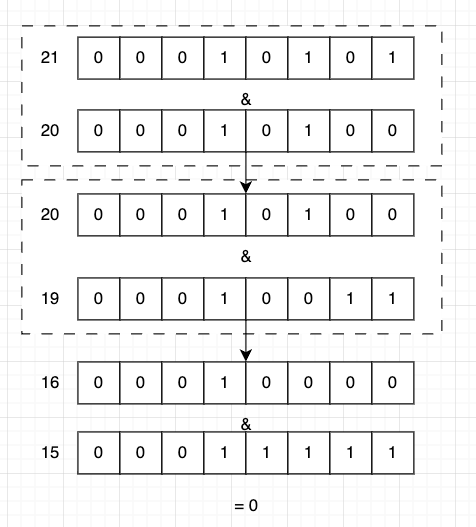

# 题目
给定一个非负整数 n ，请计算 0 到 n 之间的每个数字的二进制表示中 1 的个数，并输出一个数组。

**示例 1：**

- 输入：n = 2
- 输出：[0,1,1] 解释：
    - 0 --> 0
    - 1 --> 1
    - 2 --> 10

**示例 2：**
- 输入：n = 5
- 输出：[0,1,1,2,1,2] 解释：
    - 0 --> 0
    - 1 --> 1
    - 2 --> 10
    - 3 --> 11
    - 4 --> 100
    - 5 --> 101

# 解题思路
针对这个题目，我们有两种方法可以解决，可以使用 `奇偶数的二进制特性` 或者通过 `x = x & (x-1)` 来消 去最小位的 1 去求解。

## 奇偶数的二进制特性

**对于偶数：** 1的个数等于减半的数的1的个数。

**对于奇数：** 就是减一的那个偶数的1的个数再加上1。

所以我们可以从 1 开始到 n 进行遍历，将结果存储在 `result` 变量中，如果 i 为偶数，则直接使用减半的数的 1 的个数即可，如果为奇数，则使用减一的那个偶数的1的个数再加上1。
<Sidenote>
1. 判断奇偶可以使用与 1 进行与运算的方式来判断。
2. 减半，即除以 2 可以使用 >> 右移的位运算来实现
</Sidenote>

```python showLineNumbers {6}
class Solution {
    public int[] countBits(int n) {
        int[] result = new int[n+1];
        result[0] = 0;
        for(int i = 1; i<=n; ++i){
            result[i] = (i&1) == 1 ? result[i-1]+1 : result[i >> 1];
        }
        return result;
    }
}
```

## 消 1 法
通过 `x = x & (x-1)` 消去最小位的1, 例如：

1. 21的二进制为 `0001 0101` ，20的二进制为 `0001 0100` & 运算之后为20
2. 再将结果 20 与 19 进行 & 运算，即 `0001 0100` & `0001 0011` 结果为 16
3. 16 与 15 进行 & 运算，`0001 0000` & `0000 1111` 结果为0

```python showLineNumbers {10}
public int[] countBits(int n) {
    int[] result = new int[n+1];
    int temp = 0;
    int x = 0;
    for(int i = 0; i<=n; ++i){
        temp = 0;
        x = i;
        while(x>0){
            ++temp;
            x = x & (x-1);
        }
        result[i] = temp;
    }
    return result;
}
```