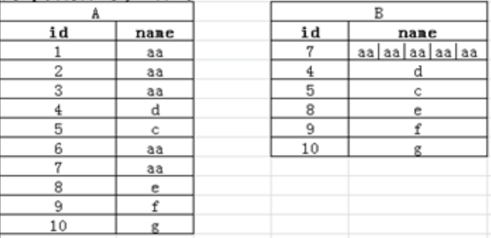

export const SAMPLE_DATA = {
    columns: [
        { id: "primary_key", title: "主键", type: "url", width: 150 },        
        {
            id: "tags",
            title: "标签",
            type: "multi-select",
            width: 200,
            options: [
                { id: "self_join", label: "自连接", bg_color: "#fba414", text_color: "#1D1712" },
                { id: "group_by", label: "分组统计", bg_color: "#1661ab", text_color: "#FFFDF8" },
                // 炸裂函数
                { id: "explode", label: "炸裂函数", bg_color: "#ce5777", text_color: "#FFFDF8" },
                // 数据展开
                { id: "unpivot", label: "数据展开", bg_color: "#1ba784", text_color: "#FFFDF8" },
                // 枚举补全
                { id: "enum_completion", label: "枚举补全", bg_color: "#f43e06", text_color: "#FFFDF8" },
                // 聚合统计
                { id: "aggregate", label: "聚合统计", bg_color: "#fcc307", text_color: "#1E1612" },
            ],
        },
        {
            id: "title",
            title: "SQL算法题所属",
            type: "multi-select",
            width: 350,
            options: [
                { id: "friend_recommendation", label: "好友推荐", color: "#00000" ,url: "/blog/algorithm/sql/sql-beginner-to-expert#好友推荐"},
                { id: "two_pair", label: "两两结对组", color: "#00000" ,url: "/blog/algorithm/sql/sql-beginner-to-expert#两两结对组"},
                { id: "firm_friendship", label: "坚定的友谊", color: "#00000" ,url: "/blog/algorithm/sql/sql-beginner-to-expert#坚定的友谊"},
                { id: "continuous_login", label: "连续登录", color: "#00000" ,url: "/blog/algorithm/sql/sql-beginner-to-expert#连续登录"},
                { id: "continuous_login", label: "数据连续", color: "#00000" ,url: "/blog/algorithm/sql/sql-beginner-to-expert#数据连续"},
                // 连胜数
                { id: "continuous_login", label: "连胜数", color: "#00000" ,url: "/blog/algorithm/sql/sql-beginner-to-expert#连胜数"},
                // 数据展开
                { id: "data_unpivot", label: "数据展开", color: "#00000" ,url: "/blog/algorithm/sql/sql-beginner-to-expert#数据展开"},
                // 同时在线人数
                { id: "simultaneous_online", label: "同时在线人数", color: "#00000" ,url: "/blog/algorithm/sql/sql-beginner-to-expert#同时在线人数"},
            ],
        },
    ],
    rows: [
        {
            id: "1",
            cells: {
                primary_key: { text: "自连接+分组统计", url: "/blog/algorithm/sql/sql-beginner-to-expert#%E8%87%AA%E8%BF%9E%E6%8E%A5%E5%88%86%E7%BB%84%E7%BB%9F%E8%AE%A1" },
                tags: ["self_join", "group_by"],
                title: ["friend_recommendation","two_pair","firm_friendship"],
            },
        },
        {
            id: "3",
            cells: {
                primary_key: { text: "数据展开", url: "/blog/algorithm/sql/sql-beginner-to-expert#数据展开" },
                tags: ["explode", "unpivot"],
                title: ["data_unpivot","simultaneous_online"],
            },
        },
        {
            id: "5",
            cells: {
                primary_key: {text: "分组连续问题", url: "/blog/algorithm/sql/sql-beginner-to-expert#分组连续问题"},
                title: ["continuous_login"],
            },
        },
        {
            id: "3",
            cells: {
                title: "Update Documentation",
                status: "done",
                tags: ["documentation"],
                effort: 1,
                link: { text: "Next.js 文档", url: "https://nextjs.org" },
            },
        },
    ],
};

<DatabaseTable initialData={SAMPLE_DATA} />

# 自连接+分组统计
本质是求得至少拥有 n 个相同属性的用户有哪些，所以可以以下的方式来实现

1. 根据共同属性进行关联，找到拥有共同属性的用户
2. 进行过滤，只保留单边
3. 对拥有共同属性的两个用户进行分组，计算拥有共同属性的数量

## 好友推荐
到所有的好友推荐，好友推荐为：用户A和用户B都听了至少3首不同的歌曲，且用户A和用户B不是好友关系
```sql
with listens(user_id, song_id,day) as (
    select 1, '10', '2021-03-15' union all
    select 1, '11', '2021-03-15' union all
    select 1, '12', '2021-03-15' union all
    select 2, '10', '2021-03-15' union all
    select 2, '11', '2021-03-15' union all
    select 2, '12', '2021-03-15' union all
    select 3, '10', '2021-03-15' union all
    select 3, '11', '2021-03-15' union all
    select 3, '12', '2021-03-15' union all
    select 4, '10', '2021-03-15' union all
    select 4, '11', '2021-03-15' union all
    select 4, '13', '2021-03-15' union all
    select 5, '10', '2021-03-16' union all
    select 5, '11', '2021-03-16' union all
    select 5, '12', '2021-03-16'
)
```
```sql
friendship (user1_id, user2_id) as (
    select 1, 2
)
```
这里的共同属性是（歌曲+时间），所以同时满足这两个属性相同的数据

```sql
t1 as (
    SELECT l1.user_id as user1_id, l2.user_id as user2_id, count(*)
    FROM listens l1
        LEFT JOIN listens l2 ON l1.song_id = l2.song_id
        AND l1.day = l2.day
    WHERE
        l1.user_id < l2.user_id
    GROUP BY
        l1.user_id,
        l2.user_id
    HAVING
        count(*) >= 3
)

SELECT *
FROM t1
WHERE
    concat(user1_id, user2_id) NOT IN (
        SELECT concat(user1_id, user2_id)
        FROM friendship
    )
```

## 两两结对组
## 坚定的友谊

# 数据展开
数据展开的解决方式

1. 找到每个需要展开的数据的起始值
2. 找到每个需要展开的数据的展开长度
3. 通过 posexplode进行展开，展开的数据通过起始值+pos 索引即可

## 数据展开
将下面的数据展开，并保持原有的数据顺序
```sql
WITH t as (
    SELECT '1-5,16,11-13,9' as a
)
```

```sql
SELECT *, pos, start_index + pos
FROM (
    -- 2. 获得每个数据的起始值和展开长度
        SELECT
            *, split (a, '-') [0] as start_index, nvl (
                split (a, '-') [1] - split (a, '-') [0], 0
            ) as diff
        FROM (
            -- 1. 先将数据展开，每个数据占一行，因为还需要按照原来的顺序排序，所以也添加上 rn 字段
                SELECT a, ROW_NUMBER() OVER () as rn
                FROM (
                        SELECT explode (split (a, ',')) as a
                        FROM t
                    ) t1
            ) t2
    -- 3. 对每个数据进行展开
    ) t3 LATERAL view posexplode (
        split (
            repeat(',', CAST(diff as INT)), ','
        )
    ) p1 as pos, val
```
## 同时在线人数
每小时的同时在线人数
```sql
with login_log (user_id,login_time,logout_time) as (
    SELECT 1,'2025-10-10 12:00:00','2025-10-10 13:35:00' UNION ALL
    SELECT 1,'2025-10-10 12:30:00','2025-10-10 12:40:00' UNION ALL
    SELECT 2,'2025-10-10 12:30:00','2025-10-10 14:35:00' UNION ALL
    SELECT 3,'2025-10-10 12:35:00','2025-10-10 15:40:00' UNION ALL
    SELECT 4,'2025-10-10 12:38:00','2025-10-10 12:40:00'
)
```
思路也很简单，就是将每个用户的登录时间和退出时间展开，然后求每个小时的同时在线人数即可
```sql
-- 1.将登陆时间进行格式化，并计算出每个用户的登录时间和退出时间之间的小时差
tmp as (
    SELECT
        user_id,
        date_format (
            login_time,
            'yyyy-MM-dd HH:00:00'
        ) as login_time,
        hour (logout_time) - hour (login_time) as hour_diff
    FROM login_log
)
-- 3.再对每个小时的同时在线人数进行统计
SELECT live_time, count(DISTINCT user_id)
FROM (
    -- 2.有了每个用户的登录时间和退出时间之间的小时差，就可以将每个用户的登录时间展开
        SELECT
            user_id, login_time, from_unixtime (
                unix_timestamp (login_time) + pos * 3600, 'yyyy-MM-dd HH:00:00'
            ) as live_time
        FROM tmp LATERAL VIEW posexplode (split (space (hour_diff), '')) t_tmp as pos, val
    ) t1
GROUP BY
    live_time
```
# 数据合并
主要是采用`concat_ws('|',collect_list(name))`的方式来进行合并，`collect_list()`是用于在 `Group by` 的基础上，将数据聚合为 `list` 的，再通过`concat_ws()`来进行合并。
## 数据合并1--京东
将数据从 A 合并到 B的样式

```sql
WITH A(id,name) as (
    SELECT 1,'aa' UNION ALL
    SELECT 2,'aa' UNION ALL
    SELECT 3,'aa' UNION ALL
    SELECT 4,'d' UNION ALL
    SELECT 5,'c' UNION ALL
    SELECT 6,'aa' UNION ALL
    SELECT 7,'aa' UNION ALL
    SELECT 8,'e' UNION ALL
    SELECT 9,'f' UNION ALL
    SELECT 10,'g'
)
```
通过 name 分组，找到最大的 id，并且将 name 进行合并
```sql
SELECT max(id), concat_ws('|', collect_list (name)) as name
FROM A
GROUP BY
    name;
```
## 数据合并2--京东
将数据从 A 合并到 C的样式

```sql
WITH A(id,name) as (
    SELECT 1,'aa' UNION ALL
    SELECT 2,'aa' UNION ALL
    SELECT 3,'aa' UNION ALL
    SELECT 4,'d' UNION ALL
    SELECT 5,'c' UNION ALL
    SELECT 6,'aa' UNION ALL
    SELECT 7,'aa' UNION ALL
    SELECT 8,'e' UNION ALL
    SELECT 9,'f' UNION ALL
    SELECT 10,'g'
)
```
1. 首先是具有**相同元素的顺序分组**，所以就要引用到相同数据连续问题的思想
2. 然后再数据合并

```sql
tmp as (
    SELECT *, sum(is_change) OVER (
            ORDER BY id
        ) group_id
    FROM (
            SELECT
                *, CASE
                    WHEN lag(name, 1) OVER (
                        ORDER BY id
                    ) != name THEN 1
                    ELSE 0
                END as is_change
            FROM A
        ) t1
)

SELECT max(id), concat_ws('|', collect_list (name)) as name
FROM tmp
GROUP BY
    group_id
```

# 分组连续问题

针对分组连续问题，主要的核心，就是找到各组的 group id，可以分为有分割点和无分割点两种类型：

1. **数据顺序连续，一般为数据+1，或者日期+1**

   1. 求出总连续，例如 `row_number`函数
   2. 求出局部分连续，**例如连续的日期**，或者其他的
   3. 局部分连续减去总连续，或者局部分连续减去总连续，得到分组
   
   一般来说，局部的分连续都已经有了，所以只需要求出总连续使用一段查询即可，使用如下的模板：
   ```sql
    date_sub (
        match_day, ROW_NUMBER() OVER (
            PARTITION BY
                player_id
            ORDER BY match_day
        )
    )
   ```
2. **相同的数据连续，例如连续 Win5 场**

   1. 通过 `lag` ，与上一个数据进行对比，创建出 `is_change` 字段，用 0 和 1 表示
   2. 再使用 `sum` 相加 `is_change`，即可得到各个分组
## 数据顺序连续问题
### 连续登录


## 相同数据连续问题

### 数据连续
将连续的 id，标上序号
```sql
with t_temp(year_col,id) as (
    SELECT 2010,1 UNION ALL
    SELECT 2011,1 UNION ALL
    SELECT 2012,1 UNION ALL
    SELECT 2013,0 UNION ALL
    SELECT 2014,0 UNION ALL
    SELECT 2015,1 UNION ALL
    SELECT 2016,1 UNION ALL
    SELECT 2017,1 UNION ALL
    SELECT 2018,0 UNION ALL
    SELECT 2019,0
)
```
所需要的输出结果如下:
```text
+--------------+--------+-----+
| t2.year_col  | t2.id  | rn  |
+--------------+--------+-----+
| 2010         | 1      | 1   |
| 2011         | 1      | 2   |
| 2012         | 1      | 3   |
| 2013         | 0      | 1   |
| 2014         | 0      | 2   |
| 2015         | 1      | 1   |
| 2016         | 1      | 2   |
| 2017         | 1      | 3   |
| 2018         | 0      | 1   |
| 2019         | 0      | 2   |
+--------------+--------+-----+
```
这是一个很标准的相同数据连续的问题。
```sql
SELECT
    *,
    ROW_NUMBER() OVER(PARTITION BY group_id ORDER BY year_col) rn
FROM (
    -- 对 is_change 进行累加，即可得到分组
    SELECT
        *,
        SUM(is_change) OVER(ORDER BY year_col) as group_id
    FROM (
        -- 先创建出 is_change 字段，用 0 和 1 表示
        SELECT
            *,
            CASE 
                WHEN id = LAG(id,1) OVER(ORDER BY year_col) THEN  0
                ELSE  1 
            END as is_change
        FROM t_temp
    ) t1
)t2
```

### 连胜数
找到每个选手的最大连胜数量，没有胜利的为 0
```sql
WITH Matches (player_id, match_day, result) AS (
    -- 选手1的比赛数据：3连胜（Win）+ 中断（Draw）+ 2连胜（Win）
    SELECT 1, '2025-01-01', 'Win' UNION ALL
    SELECT 1, '2025-01-02', 'Win' UNION ALL
    SELECT 1, '2025-01-03', 'Win' UNION ALL
    SELECT 1, '2025-01-04', 'Draw' UNION ALL
    SELECT 1, '2025-01-05', 'Win' UNION ALL
    SELECT 1, '2025-01-06', 'Win' UNION ALL
    -- 选手2的比赛数据：2连胜（Win）+ 中断（Lose）+ 4连胜（Win）
    SELECT 2, '2025-01-01', 'Win' UNION ALL
    SELECT 2, '2025-01-02', 'Win' UNION ALL
    SELECT 2, '2025-01-03', 'Lose' UNION ALL
    SELECT 2, '2025-01-04', 'Win' UNION ALL
    SELECT 2, '2025-01-05', 'Win' UNION ALL
    SELECT 2, '2025-01-06', 'Win' UNION ALL
    SELECT 2, '2025-01-07', 'Win' UNION ALL
    -- 选手3的比赛数据：无连胜（全是Draw/Lose）
    SELECT 3, '2025-01-01', 'Draw' UNION ALL
    SELECT 3, '2025-01-02', 'Lose'
)
```
这里有两种写法，因为match_day 是连续的，

1. 所以我们注意到从`result`的视角来看的话，就是相同数据的连续问题了
2. 但是我们只需要求连胜的数据， 所以将非胜利的数据过滤掉之后，问题就变成了`时间数据顺序连续的问题`。

下面是**时间数据顺序连续的问题的解法**
```sql
-- 因为是从计算时间连续的角度来考虑，所以先将胜利的数据筛选出来
base0 as (
    SELECT *
    FROM Matches
    WHERE
        result = 'Win'
),
-- 没有胜利的选手获胜数量为0，所以需要获得所有的选手数据
base1 as (
    SELECT player_id
    FROM Matches
    GROUP BY
        player_id
)
-- 再跟所有选手的数据连接后计算连胜数量即可
SELECT b1.player_id, nvl (max(win_num), 0) as max_win_cnt
FROM base1 b1
    LEFT JOIN (
        SELECT player_id, group_date, count(*) as win_num
        FROM (
            -- 通过数据连续问题的标准模板，得到分组
                SELECT *, date_sub (
                        match_day, ROW_NUMBER() OVER (
                            PARTITION BY
                                player_id
                            ORDER BY match_day
                        )
                    ) as group_date
                FROM base0
            ) t1
        GROUP BY
            player_id, group_date
    ) t2 ON b1.player_id = t2.player_id
GROUP BY
    b1.player_id
```
这里是相同数据连续问题的解法
```sql
base0 as (
    SELECT player_id
    FROM Matches
    GROUP BY player_id
)
SELECT
    b1.player_id,
    nvl(b2.max_con_win_cnt,0) as max_con_win_cnt
FROM base0 b1
LEFT JOIN (
    SELECT
        player_id,
        max(con_win_cnt) as max_con_win_cnt
    FROM (
        -- 再进行分组求和即可得到连胜数量
        SELECT
            player_id,group_id,count(*) as con_win_cnt
        FROM (
            -- 通过对is_change 进行累加，即可得到分组
            SELECT
                *,
                SUM(is_change) OVER(ORDER BY player_id,match_day) as group_id
            FROM (
                -- 获得是否变化的标志位 is_change
                SELECT
                    *,
                    IF((result) = (LAG(result,1) OVER(PARTITION BY player_id ORDER BY match_day)),0,1) as is_change
                FROM Matches
            )t1
        )t2
        WHERE result = 'Win'
        GROUP BY player_id,group_id
    )t3
    GROUP BY player_id
) b2 ON b1.player_id = b2.player_id
```

