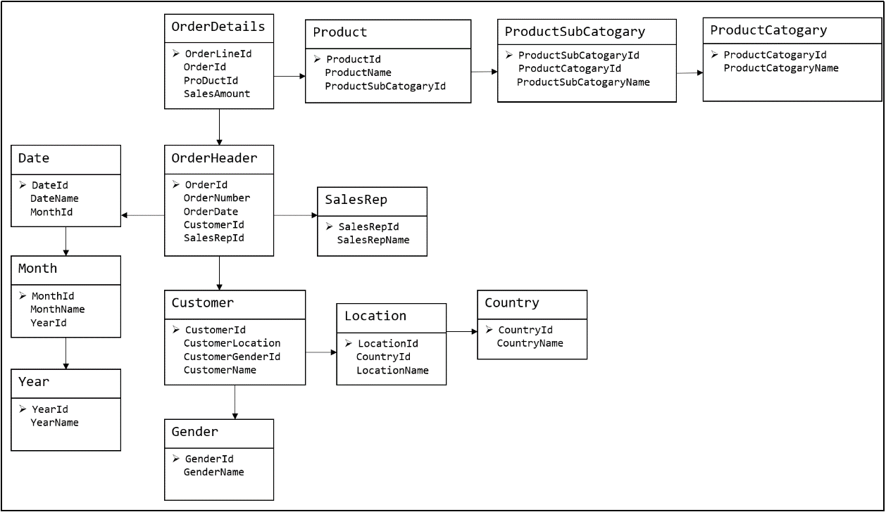
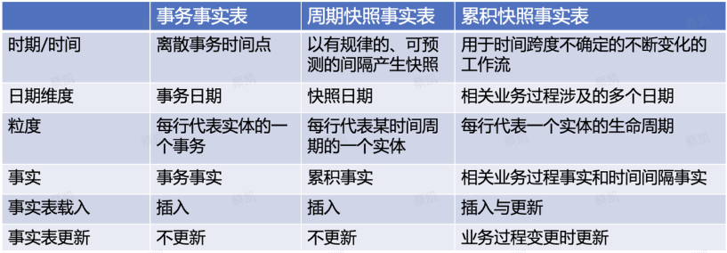
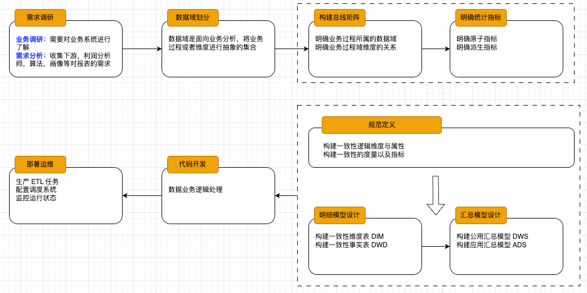
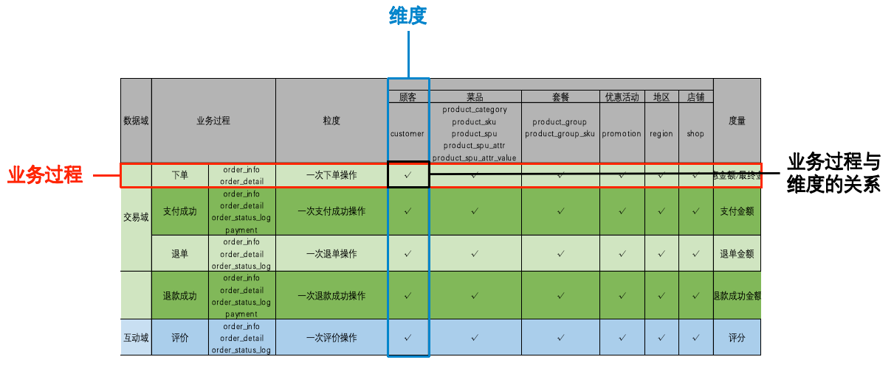

# 数仓

# 数仓分层
在学习数仓分层之前，我们先要搞明白，`为什么数仓要分层`，即数仓分层的作用与好处有哪些呢？主要有以下几点
1. **清晰数据结构**：数仓每一层都有对应的作用，方便在使用时更好定位与了解。
2. **数据血缘追踪：** 清晰知道表/任务上下游，方便排查问题，知道下游哪个模块在使用，提升开发效率及后期管理维护。
3. **减少重复开发：** 完善数仓好中间层，减少后期不必要的开发，从而减少资源消耗，保障口径、数据统一。
4. **把复杂问题简单化：** 将复杂任务拆解成多个步骤来完成，每一层处理单一步骤，当数据问题出现时候，只需从问题起点开始修复。

数仓一般分为以下的几层，分别是`ODS`,`DWD`,`DWM`,`DWS`以及`ADS`层，还有一个`DIM`层为维度层。
1. **ODS (接入层)：** ODS层是最接近数据源的一层，从数据源（api、数据库等）将数据同步数仓中，
中间不做任何处理操作
2. **DWD (明细层)：** 数仓明细数据层，对ODS层的数据进行关联，清洗，维度退化（将维度表中维度
数据放入明细表中），转换，主题域建设等操作
3. **DWM (轻度汇总层)：** 度汇总层数据仓库中DWD层和DWS层之间的一个过渡层次，是对DWD层的生
产数据进行轻度综合和汇总统计(可以把复杂指标前置处理），提升公共指标的复用性，减少重复加工
4. **DWS (汇总层)：** 按照主题域、颗粒度（例如买家、卖家）划分，按照周期粒度、维度聚合形成
指标较多的宽表，用于提供后续的业务查询，数据应用，最重要一点需要在DWS层完成指标口径统一及沉淀
5. **ADS (应用层)：** 按照应用域，颗粒度划分（例如买家、卖家）划分，按照应用主题将对应数据标
签补充至应用层，最终形成用户画像及专项应用

# 数仓模型建设

传统的 E-R 模型，是基于关系型数据库的模型，用实体关系（Entity Relationship，ER）模型来描述企业业务，并用规范化的方式表示出来，在范式理论上符合3NF。实体关系模型将复杂的数据抽象为两个概念——**实体和关系**。实体表示一个对象，例如学生、班级，关系是指两个实体之间的关系，例如学生和班级之间的从属关系。

这一系列范式就是指在设计关系型数据库时，需要遵从的不同的规范。关系型数据库的范式一共有六种，分别是第一范式（1NF）、第二范式（2NF）、第三范式（3NF）、巴斯-科德范式（BCNF）、第四范式（4NF）和第五范式（5NF）。遵循的范式级别越高，数据冗余性就越低。

下图为一个采用ER 模型建模方法构建的模型，从图中可以看出，较为松散、零碎，物理表数量多。这种建模方法的出发点是整合数据，其目的是将整个企业的数据进行组合和合并，并进行规范处理，减少数据冗余性，保证数据的一致性。这种模型并不适合直接用于分析统计。

## 维度模型

由于传统的 E-R 模型，在范式理论上符合3NF，所以数据冗余性较低，但是物理表数量多，不利于查询，所以并不适合直接用于分析统计。为此我们引出了`维度模型`。维度模型将复杂的业务通过**事实和维度**两个概念进行呈现。
- 事实通常对应业务过程，使用事实表进行存储。
- 维度通常对应业务过程发生时所处的环境，使用维度表进行存储。

### 事实表
事实表作为数据仓库维度建模的核心，紧紧围绕着业务过程来设计。其包含与该业务过程有关的维度引用（维度表外键）以及该业务过程的度量（通常是可累加的数字类型字段）。事实表记录的是业务过程，即一个个不可拆分的行为事件，事件又关联一个个的维度，而不必显示出此维度的所有信息，所以事实表通常比较细长，即列少行多，且行的增速较快。

事实表有三种分类，分别为`事务事实表`、`周期快照事实表`、`累积快照事实表`，这三种事实表的区分主要在于度量值的计算方式不同，同样的也主要作用于不同的层次。

1. **事务事实表**：主要应用于 DWD 层，一个业务过程建立一个事实表，只反应一个业务过程，对于多事务事实表，在同一个事务表中反应多个业务过程，例如订单事实表中，既包含下单、支付、退单、退款等业务过程。
2. **累积快照事实表**：主要应用于 DWD 层，用于研究事件之间的间隔需求，如统计买家下单到支付的时长，下单与发货的时间间隔等。
3. **周期快照事实表**：主要应用于 DWS 层，在确定的时间间隔内对实体的度量进行抽样，用于研究一段固定的时间内实体的度量情况。

所以**事实表的设计过程**如下：
1. 识别业务过程
2. 选择事实表的类型
3. 声明粒度与维度
4. 补充主题域下的度量值
5. 维度退化

### 维度表
事实表紧紧围绕业务过程进行设计，而维度表则围绕业务过程所处的环境进行设计。维度表主要包含一个主键和各种维度字段，维度字段称为维度属性。

**维度退化：** 如果某些维度表的维度很少，则可以将维度表中的维度属性直接插入到事实表中，从而减少一次关联查询，提高查询性能。例如，订单事实表中，订单状态维度表的维度很少，则可以将订单状态维度表中的维度属性直接插入到事实表中。

## 模型建设过程

### 需求调研

主要包含业务调研与需求分析，`业务调研主要是熟悉业务流程、熟悉业务数据`。需求分析主要是分析业务需求，确定数据仓库的架构。

### 数据域划分
根据业务情况进行划分数据域，通常可以根据业务过程或者部门进行划分。
<Callout type="warning">
**注意：** 一个业务过程只能属于一个数据域
</Callout>
例如下面的一个电商的数仓的数据域划分：

| 数据域 | 业务过程 | 
| --- | --- |
| **交易域** | 下单，取消订单，支付成功，退单，退款成功 |
| **流量域** | 商品浏览，启动应用，动作点击 |
| **用户域** | 注册，登录 |
| **互动域** | 收藏，评价 |
| **工具域** | 优惠券领取，优惠券使用 |

### 总线矩阵
当数据域划分完成，我们就要构建业务过程与维度的关系，一个业务过程对应维度模型中一张事务型事实表，一个维度则对应维度模型中的一张维度表。所以构建业务总线矩阵的过程就是设计维度模型的过程。针对DWD 层以及 DIM 层等都需要参考业务总线矩阵。

从业务总线矩阵中我们可以看到很多的信息，例如一个业务过程所涉及的维度，一个业务过程所使用到的表，一个业务过程的粒度等信息。

