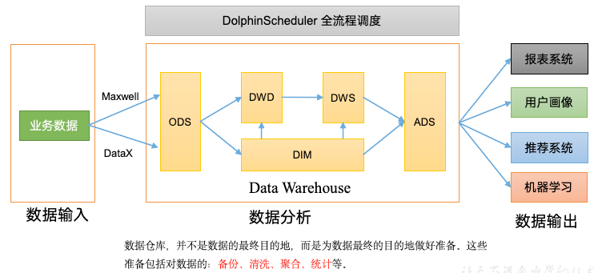

# 数仓的概念
数据仓库，Data Warehouse 是一个用于存储、整合和分析大规模数据的系统，旨在支持商业智能、数据分析和决策支持。数据仓库是一个面向主题的、集成的、稳定的、随时间变化的数据集合，它从多个数据源（如数据库、日志、外部系统）中抽取、转换和加载（ETL）数据，优化查询和分析性能。主要的作用体现在下面几个方面：
1. **数据整合与统一存储：** 将来自不同业务系统、格式各异的数据（如数据库、日志、外部API等）进行抽取、转换和加载（ETL过程），整合成统一的数据存储平台，便于集中管理和分析。
2. **复杂分析与决策：** 数仓通过结构化的数据组织（如星型模型、雪花模型）支持复杂的数据分析需求，包括报表生成、数据挖掘、趋势分析等，为业务决策提供数据支撑。
3. **数据质量与一致性保障：** 数仓通过数据清洗、去重、标准化等操作，确保数据的高质量和一致性，减少数据冗余和错误，提升分析结果的可靠性。
4. **解耦业务与分析：** 数仓将数据分析与业务系统分离，降低对业务系统的直接查询压力，提高系统性能，同时为数据科学家和分析师提供独立的分析环境。



**数仓上游：**

即数仓的数据来源，输入数据通常包括：`业务数据、用户行为数据和爬虫数据`等。
- 业务数据就是各行业在处理事务过程中产生的数据。
- 用户行为数据：用户在使用产品过程中，通过埋点收集与客户端产品交互过程中产生的数据，并发往日志服务器进行保存。比如页面浏览、点击、停留、评论、点赞、收藏等。用户行为数据通常存储在日志文件中。
- 爬虫数据：通常是通过技术手段获取其他公司网站的数据。

**数仓下游：**

数仓的处理完成的数据可以用于`数据分析与报表`，`数据挖掘与机器学习`，`业务应用`与`运营监控与决策支持`等。

# 数仓分层
## 数仓分层原因
在学习数仓分层之前，我们先要搞明白，`为什么数仓要分层`，即数仓分层的作用与好处有哪些呢？主要有以下几点
1. **清晰数据结构**：数仓每一层都有对应的作用，方便在使用时更好定位与了解。
2. **数据血缘追踪：** 清晰知道表/任务上下游，方便排查问题，知道下游哪个模块在使用，提升开发效率及后期管理维护。
3. **减少重复开发：** 完善数仓好中间层，减少后期不必要的开发，从而减少资源消耗，保障口径、数据统一。
4. **把复杂问题简单化：** 将复杂任务拆解成多个步骤来完成，每一层处理单一步骤，当数据问题出现时候，只需从问题起点开始修复。
## 数仓分层
数仓一般分为以下的几层，分别是`ODS`,`DWD`,`DWM`,`DWS`以及`ADS`层，还有一个`DIM`层为维度层。
1. **ODS (接入层)：** ODS层是最接近数据源的一层，从数据源（api、数据库等）将数据同步数仓中，
中间不做任何处理操作
2. **DWD (明细层)：** 数仓明细数据层，对ODS层的数据进行关联，清洗，维度退化（将维度表中维度
数据放入明细表中），转换，主题域建设等操作
3. **DWM (轻度汇总层)：** 度汇总层数据仓库中DWD层和DWS层之间的一个过渡层次，是对DWD层的生
产数据进行轻度综合和汇总统计(可以把复杂指标前置处理），提升公共指标的复用性，减少重复加工
4. **DWS (汇总层)：** 按照主题域、颗粒度（例如买家、卖家）划分，按照周期粒度、维度聚合形成
指标较多的宽表，用于提供后续的业务查询，数据应用，最重要一点需要在DWS层完成指标口径统一及沉淀
5. **ADS (应用层)：** 按照应用域，颗粒度划分（例如买家、卖家）划分，按照应用主题将对应数据标
签补充至应用层，最终形成用户画像及专项应用

# 数仓模型建设

传统的 E-R 模型，是基于关系型数据库的模型，用实体关系（Entity Relationship，ER）模型来描述企业业务，并用规范化的方式表示出来，在范式理论上符合3NF。实体关系模型将复杂的数据抽象为两个概念——**实体和关系**。实体表示一个对象，例如学生、班级，关系是指两个实体之间的关系，例如学生和班级之间的从属关系。

这一系列范式就是指在设计关系型数据库时，需要遵从的不同的规范。关系型数据库的范式一共有六种，分别是第一范式（1NF）、第二范式（2NF）、第三范式（3NF）、巴斯-科德范式（BCNF）、第四范式（4NF）和第五范式（5NF）。遵循的范式级别越高，数据冗余性就越低。

下图为一个采用ER 模型建模方法构建的模型，从图中可以看出，较为松散、零碎，物理表数量多。这种建模方法的出发点是整合数据，其目的是将整个企业的数据进行组合和合并，并进行规范处理，减少数据冗余性，保证数据的一致性。这种模型并不适合直接用于分析统计。


## 维度模型

由于传统的 E-R 模型，在范式理论上符合3NF，所以数据冗余性较低，但是物理表数量多，不利于查询，所以并不适合直接用于分析统计。为此我们引出了`维度模型`。维度模型将复杂的业务通过**事实和维度**两个概念进行呈现。
- 事实通常对应业务过程，使用事实表进行存储。
- 维度通常对应业务过程发生时所处的环境，使用维度表进行存储。

### 事实表
事实表作为数据仓库维度建模的核心，紧紧围绕着业务过程来设计。其包含与该业务过程有关的维度引用（维度表外键）以及该业务过程的度量（通常是可累加的数字类型字段）。事实表记录的是业务过程，即一个个不可拆分的行为事件，事件又关联一个个的维度，而不必显示出此维度的所有信息，所以事实表通常比较细长，即列少行多，且行的增速较快。

事实表有三种分类，分别为`事务事实表`、`周期快照事实表`、`累积快照事实表`，这三种事实表的区分主要在于度量值的计算方式不同，同样的也主要作用于不同的层次。

1. **事务事实表**：主要应用于 DWD 层，一个业务过程建立一个事实表，只反应一个业务过程，对于多事务事实表，在同一个事务表中反应多个业务过程，例如订单事实表中，既包含下单、支付、退单、退款等业务过程。
2. **累积快照事实表**：主要应用于 DWD 层，用于研究事件之间的间隔需求，如统计买家下单到支付的时长，下单与发货的时间间隔等。
3. **周期快照事实表**：主要应用于 DWS 层，在确定的时间间隔内对实体的度量进行抽样，用于研究一段固定的时间内实体的度量情况。


所以**事实表的设计过程**如下：
1. 识别业务过程
2. 选择事实表的类型
3. 声明粒度与维度
4. 补充主题域下的度量值
5. 维度退化


### 维度表
事实表紧紧围绕业务过程进行设计，而维度表则围绕业务过程所处的环境进行设计。维度表主要包含一个主键和各种维度字段，维度字段称为维度属性。

**维度退化：** 如果某些维度表的维度很少，则可以将维度表中的维度属性直接插入到事实表中，从而减少一次关联查询，提高查询性能。例如，订单事实表中，订单状态维度表的维度很少，则可以将订单状态维度表中的维度属性直接插入到事实表中。

### 拉链表
拉链表是一种特殊的维度表，用于处理**缓慢变化维（SCD, Slowly Changing Dimension）** 的数据表设计方式，通常用于存储具有历史变化的维度数据（如客户信息、产品信息等）。它通过记录每个记录的有效时间范围（通常以开始时间和结束时间标记）来维护数据的全量历史变化。

我们可以针对一个例子来进行分析，假设我们需要跟踪客户（Customer）的地址信息变化，客户可能因为搬家或其他原因导致地址发生变化，我们希望保留所有历史记录，并知道每个地址在什么时间段内是有效的。这个客户的地址信息表就是拉链表。表结构如下：
<Sidenote>
`is_active` 这个列也可以不使用，直接使用 `end_date` 是否为`9999-12-31`来判断是否为当前有效记录。
</Sidenote>
```sql showLineNumbers {5,6}
CREATE TABLE dim_customer_zip (
    customer_id INT,           -- 客户ID（唯一标识客户）
    customer_name STRING,     -- 客户姓名
    address STRING,           -- 客户地址
    start_date DATE,          -- 记录有效开始时间
    end_date DATE,            -- 记录有效结束时间
    is_active BOOLEAN         -- 是否为当前有效记录
);
```
例如如下的数据：
| customer_id | customer_name | address | start_date | end_date | is_active |
| --- | --- | --- | --- | --- | --- |
| 1 | 张三 | 北京 | 2025-01-01 | 2025-01-01 | false |
| 1 | 张三 | 上海 | 2025-01-02 | 2025-05-20 | false |
| 1 | 张三 | 广州 | 2025-05-21 | 9999-12-31 | true |

可以直观的反应出客户张三的地址变化，以及当前的有效地址。但是拉链表的难点是其实现过程，具体的思路很好分析，可以按照如下的步骤：
1. 将当前的维度数据插入到拉链表中，并设置 `end_date` 为 `9999-12-31`，`is_active` 为 `true`。
2. 将上一条记录的`end_date`更新为新记录的`start_date - 1`，并将`is_active`置为`false`。

<Callout type="danger">
**错误：** 但是我们知道，在大数据开发的表中，除了使用`DataBrick`下的`Delta`表，其他表都是使用`Hive`表，而`Hive`表不支持`update`操作，所以不能直接使用`update`操作来更新拉链表。
</Callout>

所以我们针对拉链表的更新，可以按照如下的方法来进行更新：

首先，我们先创建一个同样字段的增量表，用于`存储新增的或者变化的数据`。
```sql showLineNumbers {1}
CREATE TABLE dim_customer_zip_increment (
    customer_id INT,           -- 客户ID（唯一标识客户）
    customer_name STRING,     -- 客户姓名
    address STRING,           -- 客户地址
    start_date DATE,          -- 记录有效开始时间
    end_date DATE,            -- 记录有效结束时间
    is_active BOOLEAN         -- 是否为当前有效记录
);
```
例如变化的数据为：
| customer_id | customer_name | address | start_date | end_date | is_active |
| --- | --- | --- | --- | --- | --- |
| 1 | 张三 | 杭州 | 2025-07-01 | 9999-12-31 | true |

再创建一个临时表，临时表的表结构与拉链表的表结构也一致，用于`存储更新后的数据`，这样的话我们就有了三个表，分别是：`拉链表`、`增量表`、`临时表`。

我们将`拉链表`与`增量表`使用`union all` 进行合并，并将拉链表中`end_date`为`9999-12-31`的记录更新为`增量表`中的`start_date - 1`，并将`is_active`置为`false`，然后使用`insert into` 将临时表中的数据插入到拉链表中。这样的话就实现了更新原来的`拉链表`中的历史数据，并且将新增或者变化的`增量表`中的数据也写入了进去。

```sql showLineNumbers {10,11,13}
INSERT INTO dim_customer_zip
SELECT * FROM (
    SELECT * FROM dim_customer_zip_increment
    UNION ALL
    SELECT 
        t1.customer_id,
        t1.customer_name,
        t1.address,
        t1.start_date,
        IF(t1.is_active, date_sub(t2.start_date, 1), t1.end_date) AS end_date,
        IF(t1.is_active, 'false', t1.is_active) AS is_active
    FROM dim_customer_zip t1
    LEFT JOIN dim_customer_zip_increment t2 ON t1.customer_id = t2.customer_id
) t;
```
<Callout type="warning">
**注意：** 但是这里很显然存在一个问题，我们的`增量表`默认是最新的数据，一个用户只有一条，想想看如果这个用户改变了多次呢，那么我们的`增量表`似乎就变成了另外一个需要处理的`拉链表`了，所以由于**拉链表**是一种变换缓慢的表，我们可以进行批处理，使得`增量表`中的数据只有最新的一个。
</Callout>


## 模型建设过程


### 需求调研

主要包含业务调研与需求分析，`业务调研主要是熟悉业务流程、熟悉业务数据`。需求分析主要是分析业务需求，确定数据仓库的架构。


### 数据域划分
根据业务情况进行划分数据域，通常可以根据业务过程或者部门进行划分。
<Callout type="warning">
**注意：** 一个业务过程只能属于一个数据域
</Callout>
例如下面的一个电商的数仓的数据域划分：

| 数据域 | 业务过程 | 
| --- | --- |
| **交易域** | 下单，取消订单，支付成功，退单，退款成功 |
| **流量域** | 商品浏览，启动应用，动作点击 |
| **用户域** | 注册，登录 |
| **互动域** | 收藏，评价 |
| **工具域** | 优惠券领取，优惠券使用 |


### 总线矩阵
当数据域划分完成，我们就要构建业务过程与维度的关系，一个业务过程对应维度模型中一张事务型事实表，一个维度则对应维度模型中的一张维度表。所以构建业务总线矩阵的过程就是设计维度模型的过程。针对DWD 层以及 DIM 层等都需要参考业务总线矩阵。


从业务总线矩阵中我们可以看到很多的信息，例如一个业务过程所涉及的维度，一个业务过程所使用到的表，一个业务过程的粒度等信息。

# 数仓小测验
export const warehouseQuizData = [
  {
    question: "在数据仓库分层架构中，哪一层的主要职责是对来自ODS层的数据进行清洗、维度退化和关联，形成统一的、规范化的明细数据？",
    options: [
      "ODS (接入层)",
      "DWD (明细层)",
      "DWS (汇总层)",
      "ADS (应用层)"
    ],
    correctAnswer: "DWD (明细层)",
    explanation: "DWD层是数据仓库的核心层之一，它承接ODS层的原始数据，进行ETL（抽取、转换、加载）中的关键转换步骤，如数据清洗、去除杂质、维度关联、维度退化等，最终形成面向主题的、干净、一致的明细事实表。这是后续DWS层进行数据汇总的基础。"
  },
  {
    question: "为什么传统的关系型数据库E-R模型（遵循第三范式3NF）不适合直接用于数据仓库的分析查询？",
    options: [
      "因为它无法处理大规模数据",
      "因为它无法保证数据的一致性",
      "因为它高度规范化，导致物理表过多，查询时需要大量关联（Join），性能低下",
      "因为它不支持SQL查询"
    ],
    correctAnswer: "因为它高度规范化，导致物理表过多，查询时需要大量关联（Join），性能低下",
    explanation: "E-R模型为了消除数据冗余，会把数据拆分到非常多的表中（符合3NF）。这种设计在事务处理（OLTP）系统中非常高效，但在数据分析（OLAP）场景下，需要分析师将这些分散的表重新关联起来，导致查询语句复杂且执行效率极低。维度模型则通过适度冗余（反范式）来优化查询性能。"
  },
  {
    question: "如果业务需求是分析“用户从首次浏览商品到最终下单支付整个过程的转化周期”，应该优先选择哪种类型的事实表进行设计？",
    options: [
      "事务事实表",
      "周期快照事实表",
      "累积快照事实表",
      "维度表"
    ],
    correctAnswer: "累积快照事实表",
    explanation: "累积快照事实表专门用于跟踪有明确生命周期（开始、中间状态、结束）的业务过程。它的一行数据代表一个完整的业务实例（例如一个订单），并包含多个关键业务节点的时间戳（如浏览时间、加购时间、下单时间、支付时间）。这使得计算各阶段之间的时长和转化率变得非常直接和高效。"
  },
  {
    question: "文中提到的拉链表（Zipper Table）主要是为了解决数据仓库中的哪一类经典问题？",
    options: [
      "快速变化维（Rapidly Changing Dimension）",
      "缓慢变化维（Slowly Changing Dimension, SCD）",
      "数据量爆炸性增长的事实数据存储",
      "实时数据同步延迟"
    ],
    correctAnswer: "缓慢变化维（Slowly Changing Dimension, SCD）",
    explanation: "拉链表是处理“缓慢变化维”问题的一种常用技术。当维度属性（如客户地址、产品分类）会发生变化，而我们又需要保留其所有历史状态时，就可以使用拉链表。它通过`start_date`和`end_date`字段来记录每个版本维度的生命周期，从而能够准确地回溯任意时间点的历史数据快照。"
  },
  {
    question: "在设计拉链表并用Hive实现更新时，文中指出不能直接使用`UPDATE`语句，其根本原因是什么？",
    options: [
      "Hive的SQL语法不完整，缺少UPDATE关键字",
      "拉链表的逻辑过于复杂，UPDATE无法处理",
      "Hive基于HDFS，其底层文件系统遵循“一次写入，多次读取”的原则，不支持对已写入数据进行原地修改",
      "执行UPDATE操作会锁定全表，导致性能问题"
    ],
    correctAnswer: "Hive基于HDFS，其底层文件系统遵循“一次写入，多次读取”的原则，不支持对已写入数据进行原地修改",
    explanation: "这是大数据环境中一个非常核心的知识点。传统的Hive表是构建在HDFS之上的，而HDFS的设计理念是数据不变性（Immutability）。因此，无法像传统关系型数据库那样执行`UPDATE`或`DELETE`。更新拉链表需要通过读取旧数据和增量数据，在内存或临时表中计算出最新的全量状态，然后通过`INSERT OVERWRITE`的方式重写整个分区或表，从而实现逻辑上的“更新”。（注意：像Delta Lake或Iceberg等新的表格式正在改变这一现状，但传统的Hive表确实如此。）"
  },
  {
    question: "在数据仓库建模的初期阶段，构建“业务总线矩阵（Bus Matrix）”的核心作用是什么？",
    options: [
      "规划数据域的负责人和权限",
      "设计ETL任务的调度依赖关系",
      "定义企业级的核心业务过程，并明确每个过程与哪些维度相关，作为后续维度建模的蓝图",
      "选择最终报表和BI工具"
    ],
    correctAnswer: "定义企业级的核心业务过程，并明确每个过程与哪些维度相关，作为后续维度建模的蓝图",
    explanation: "业务总线矩阵是数据仓库建设的基石。它是一个表格，行代表业务过程（对应未来的事实表），列代表维度（对应未来的维度表）。通过在矩阵中标记，可以清晰地梳理出整个企业的核心数据模型，确保维度的一致性（“一次定义，处处使用”），并指导DWD层事实表和DIM层维度表的具体设计，是保障数仓规范性和可扩展性的重要工具。"
  }
];

<QuizBar questions={warehouseQuizData} />