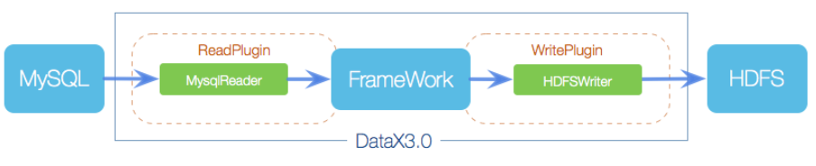
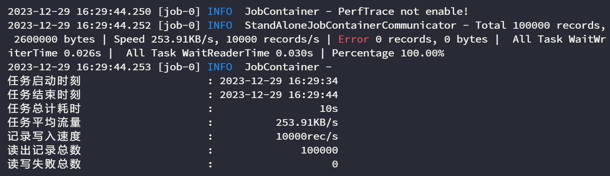
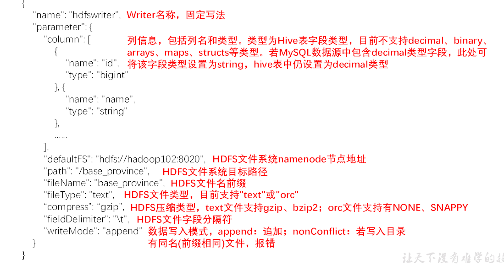
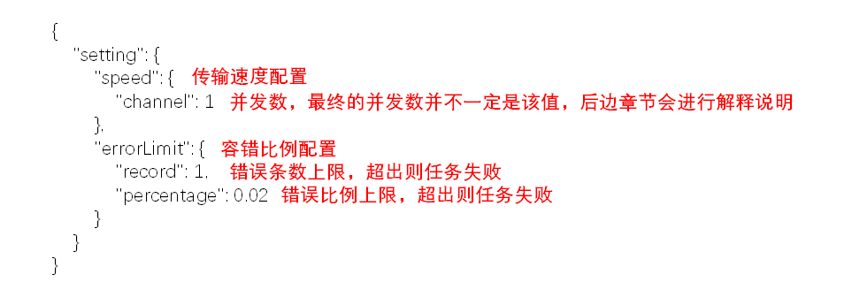

# DataX

## 参考

[GitHub - alibaba/DataX: DataX 是阿里云 DataWorks 数据集成的开源版本。](https://github.com/alibaba/DataX)

## 概念

DataX 是一个通用的数据同步框架，由阿里巴巴集团开发和使用。它旨在实现不同数据源之间的高效数据同步功能，包括 MySQL、Oracle、SqlServer、Postgre、HDFS、Hive、ADS、HBase、TableStore(OTS)、MaxCompute(ODPS)、DRDS 和 OceanBase 数据库等各种异构数据源[[1]](https://www.oceanbase.com/docs/enterprise-oceanbase-database-cn-10000000000362445)。

## DataX 核心架构

DataX 的设计理念是将数据源的同步抽象为 Reader 插件和 Writer 插件，通过 Framework 作为数据传输通道，实现数据的读取和写入。DataX 的插件体系非常丰富，支持主流的关系型数据库、NoSQL 数据库和大数据计算系统。


## 参数调优

### 空值处理

HFDS Writer 并未提供 nullFormat 参数：也就是用户并不能自定义 null 值写到 HFDS 文件中的存储格式。默认情况下，HFDS Writer 会将 null 值存储为空字符串（‘’），而 Hive 默认的 null 值存储格式为\N。所以后期将 DataX 同步的文件导入 Hive 表就会出现问题。

通俗点来说就是：**DataX 同步过来的数据，如果某列的值为 null，那么 HFDS Writer 会将该列存储为空字符串（‘’），而 Hive 默认的 null 值存储格式为\N。所以后期将 DataX 同步的文件导入 Hive 表就会出现问题。**

解决方案：

1. 修改 DataX 的 HFDS Writer 的配置，将 null 值存储为空字符串（‘’）。
2. 修改 Hive 表的配置，将 null 值存储为空字符串（‘’）。

**方法一：修改 DataX 的 HFDS Writer 的配置，将 null 值存储为空字符串（‘’）：**

- 修改 DataX HDFS Writer 的源码，增加自定义的 null 值存储格式，参考[记 Datax3.0 解决 MySQL 抽数到 HDFSNULL 变为空字符的问题\_datax nullformat-CSDN 博客](https://blog.csdn.net/u010834071/article/details/105506580 "记Datax3.0解决MySQL抽数到HDFSNULL变为空字符的问题_datax nullformat-CSDN博客")

**方法二：修改 Hive 表的配置，将 null 值存储为空字符串（‘’）**

- 在 Hive 表中建表的时候指定 null 值的存储格式为空字符串''

```sql {12} showLineNumbers
DROP TABLE IF EXISTS base_province;
CREATE EXTERNAL TABLE base_province
(
    `id`         STRING COMMENT '编号',
    `name`       STRING COMMENT '省份名称',
    `region_id`  STRING COMMENT '地区ID',
    `area_code`  STRING COMMENT '地区编码',
    `iso_code`   STRING COMMENT '旧版ISO-3166-2编码，供可视化使用',
    `iso_3166_2` STRING COMMENT '新版IOS-3166-2编码，供可视化使用'
) COMMENT '省份表'
    ROW FORMAT DELIMITED FIELDS TERMINATED BY '\t'
    NULL DEFINED AS ''
    LOCATION '/base_province/';
```

## DataX 的安装与配置

下载 DataX 的安装包：可以去[GitHub - alibaba/DataX: DataX 是阿里云 DataWorks 数据集成的开源版本。](https://github.com/alibaba/DataX)找最新版来使用。
:::danger
如果使用老版本，则需要使用 Python2 版本，不太方便。
:::

下载 DataX

```bash
curl -O https://datax-opensource.oss-cn-hangzhou.aliyuncs.com/202308/datax.tar.gz
```

将其移动到`/opt/software`下，然后解压到`/opt/module`中。

```bash
tar -zxvf datax.tar.gz -C /opt/module/
```

检查是否安装成功

```bash
python /opt/module/datax/bin/datax.py /opt/module/datax/job/job.json
```

显示如下的内容则运行成功


## DataX 的使用

本质上就是用户只需要根据自己的需求根据**数据源**和**目的地**来选择相应的**Reader**和**Writer**，然后将 Reader 和 Writer 的信息配置到一个**Json**文件中，然后再提交数据同步任务即可。

```bash
python bin/datax.py <path/to/your/job.json>
```

### MYSQLReader

MySQLReader 官方文档：[MysqlReader 插件文档](https://github.com/alibaba/DataX/blob/master/mysqlreader/doc/mysqlreader.md)

MySQLReader 有两种模式，分别为**TableMode**和**QuerySQLMode**。

1. **TableMode**：使用 table，column，where 等属性声明需要同步的数据
2. **QuerySQLMode**，使用一条 SQL 语句声明需要同步的数据

### TableMode

配置文件如下

```json showLineNumbers
{
  "job": {
    "content": [
      {
        "reader": {
          "name": "mysqlreader",
          // 需要同步的数据表的参数
          "parameter": {
            // 同步的数据表的列
            "column": [
              "id",
              "name",
              "region_id",
              "area_code",
              "iso_code",
              "iso_3166_2",
              "create_time",
              "operate_time"
            ],
            // 同步条件
            "where": "id>=3",
            "connection": [
              {
                "jdbcUrl": [
                  "jdbc:mysql://hadoop102:3306/gmall?useUnicode=true&allowPublicKeyRetrieval=true&characterEncoding=utf-8"
                ],
                // 同步的数据表的名称
                "table": ["base_province"]
              }
            ],
            "password": "000000",
            "splitPk": "",
            "username": "root"
          }
        },
        "writer": {
          "name": "hdfswriter",
          "parameter": {
            "column": [
              {
                "name": "id",
                "type": "bigint"
              },
              {
                "name": "name",
                "type": "string"
              },
              {
                "name": "region_id",
                "type": "string"
              },
              {
                "name": "area_code",
                "type": "string"
              },
              {
                "name": "iso_code",
                "type": "string"
              },
              {
                "name": "iso_3166_2",
                "type": "string"
              },
              {
                "name": "create_time",
                "type": "string"
              },
              {
                "name": "operate_time",
                "type": "string"
              }
            ],
            "compress": "gzip",
            "defaultFS": "hdfs://hadoop102:8020",
            "fieldDelimiter": "\t",
            "fileName": "base_province",
            "fileType": "text",
            "path": "/base_province",
            "writeMode": "append"
          }
        }
      }
    ],
    "setting": {
      "speed": {
        "channel": 1
      }
    }
  }
}
```

HDFS-Writer 参数说明


seting 参数说明

**提交任务**

:::warning
使用 DataX 向 HDFS 同步数据时，需**确保目标路径已存在**
:::

创建目标路径

```bash
hadoop fs -mkdir /base_province
```

进入 DataX 目录，并执行

```bash
cd /opt/module/datax
python bin/datax.py job/base_province.json
```

### QuerySQLMode

同样的也是编写`json`配置文件

```json
{
  "job": {
    "content": [
      {
        "reader": {
          "name": "mysqlreader",
          "parameter": {
            "connection": [
              {
                "jdbcUrl": [
                  "jdbc:mysql://hadoop102:3306/gmall?useUnicode=true&allowPublicKeyRetrieval=true&characterEncoding=utf-8"
                ],
                "querySql": [
                  "select id,name,region_id,area_code,iso_code,iso_3166_2,create_time,operate_time from base_province where id>=3"
                ]
              }
            ],
            "password": "000000",
            "username": "root"
          }
        },
        "writer": {
          "name": "hdfswriter",
          "parameter": {
            "column": [
              {
                "name": "id",
                "type": "bigint"
              },
              {
                "name": "name",
                "type": "string"
              },
              {
                "name": "region_id",
                "type": "string"
              },
              {
                "name": "area_code",
                "type": "string"
              },
              {
                "name": "iso_code",
                "type": "string"
              },
              {
                "name": "iso_3166_2",
                "type": "string"
              },
              {
                "name": "create_time",
                "type": "string"
              },
              {
                "name": "operate_time",
                "type": "string"
              }
            ],
            "compress": "gzip",
            "defaultFS": "hdfs://hadoop102:8020",
            "fieldDelimiter": "\t",
            "fileName": "base_province",
            "fileType": "text",
            "path": "/base_province",
            "writeMode": "append"
          }
        }
      }
    ],
    "setting": {
      "speed": {
        "channel": 1
      }
    }
  }
}
```

### DataX 传参

通常情况下，离线数据同步任务需要每日定时重复执行，<span style={{color:'red'}}>故 HDFS 上的目标路径通常会包含一层日期</span>，以对每日同步的数据加以区分，也就是说每日同步数据的目标路径不是固定不变的，因此 DataX 配置文件中 HDFS Writer 的 path 参数的值应该是动态的。为实现这一效果，就需要使用 DataX 传参的功能。

DataX 传参的用法如下，在 JSON 配置文件中使用`${param}`引用参数，在提交任务时使用`-p"-Dparam=value"`传入参数值，具体示例如下。

在 HDFSWriter 中

```json {6} showLineNumbers
"compress": "gzip",
"defaultFS": "hdfs://hadoop102:8020",
"fieldDelimiter": "\t",
"fileName": "base_province",
"fileType": "text",
"path": "/base_province/${dt}",
"writeMode": "append"
```

先创建目标路径

```bash
hadoop fs -mkdir /base_province/2022-06-08
```

在 DataX 根目录下执行

```bash
python bin/datax.py -p"-Ddt=2022-06-08" job/base_province.json
```

### Transformer 数据清晰与转换

可以对 Reader 读取的数据进行某些操作，然后再传递给 Writer 写入目标端。

假设我们有一个从 MySQL 读取数据，并将其写入到 HDFS 的任务，在这个过程中，我们需要将一个日期字段格式化为 yyyy-MM-dd 格式。我们可以使用 dx_groovy Transformer 来实现。

```json
{
  "job": {
    "setting": {
      "speed": {
        "channel": 3
      }
    },
    "content": [
      {
        "reader": {
          "name": "mysqlreader",
          "parameter": {
            "username": "your_username",
            "password": "your_password",
            "column": ["id", "name", "date"],
            "splitPk": "id",
            "connection": [
              {
                "table": ["your_table"],
                "jdbcUrl": ["jdbc:mysql://your_mysql_host:3306/your_database"]
              }
            ]
          }
        },
        "transformer": [
          {
            "name": "dx_groovy",
            "parameter": {
              "columnIndex": 2,
              "paras": [
                "def format = new java.text.SimpleDateFormat('yyyy-MM-dd');"
                + "format.format(new java.text.SimpleDateFormat('yyyy-MM-dd HH:mm:ss').parse(trans[2]));"
              ]
            }
          }
        ],
        "writer": {
          "name": "hdfswriter",
          "parameter": {
            "defaultFS": "hdfs://your_hdfs_host:8020",
            "fileType": "text",
            "path": "/path/to/your/hdfs/directory",
            "fileName": "your_output_file",
            "column": ["id", "name", "date"],
            "writeMode": "overwrite"
          }
        }
      }
    ]
  }
}
```

使用的是内置的 Transformer 的 dx_groovy，用于执行自定义的脚本操作，columnIndex: 指定了需要转换的字段列的索引（从 0 开始），这里是第 3 列，即 date 列。paras: 这是脚本表达式，将 date 字段从原来的格式 yyyy-MM-dd HH:mm:ss 转换为 yyyy-MM-dd。

## DataX 配置文件生成器

在进行大数据项目的处理当中，datax 经常用在每日的全量数据同步，那么针对于每一个表，我们都需要写一个 json 配置文件，而大型项目往往有许多的表，一个一个写显然效率非常的低下，所以我们可以做一个 DataX 的配置生成器，可以自动的生成我们需要的配置文件。

将生成器上传到`/opt/module/gen_datax_config`目录下，修改`configuration.properties`配置文件。

```properties showLineNumbers
mysql.username=root
mysql.password=000000
mysql.host=hadoop102
mysql.port=3306
mysql.database.import=gmall
# mysql.database.export=gmall
mysql.tables.import=activity_info,activity_rule,base_trademark,cart_info,base_category1,base_category2,base_category3,coupon_info,sku_attr_value,sku_sale_attr_value,base_dic,sku_info,base_province,spu_info,base_region,promotion_pos,promotion_refer
# mysql.tables.export=
is.seperated.tables=0
hdfs.uri=hdfs://hadoop102:8020
import_out_dir=/opt/module/datax/job/import
# export_out_dir=
```

- `mysql.username`：MySQL 用户名
- `mysql.password`：MySQL 密码
- `mysql.host`：MySQL 主机地址
- `mysql.port`：MySQL 端口号
- `mysql.database.import`：需要同步的 MySQL 数据库名
- `mysql.database.export`：需要导出的 MySQL 数据库名
- `mysql.tables.import`：需要同步的 MySQL 表名
- `mysql.tables.export`：需要导出的 MySQL 表名
- `is.seperated.tables`：是否需要分表同步，0 表示不分表，1 表示分表
- `hdfs.uri`：HDFS 主机地址
- `import_out_dir`：同步数据的目标路径
- `export_out_dir`：导出数据的目标路径

运行生成器 Jar 包

```bash
java -jar datax-config-generator-1.0-SNAPSHOT-jar-with-dependencies.jar
```

观察结果是否生成，然后再测试生成的配置能否正常运行

```bash
ll /opt/module/datax/job/import
```

## 实操

### 同步 MySQL 数据到 HDFS

数据源为 MySQL，所以要使用 MySQLReader
目的地为 HDFS，所以使用 HDFSWriter