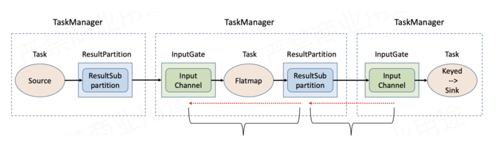
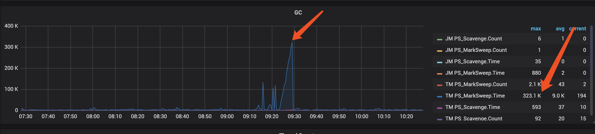

# Flink 反压
反压（Backpressure）是流处理系统中一种**上游生产速度超过下游消费速度时，系统自动向上游传递"减速"信号的自我保护机制**。

在 Flink 中，数据以流的形式在 Task 之间流动。当某个算子的处理能力跟不上上游的数据输入速率时，它的输入缓冲区会逐渐被填满。如果没有反压机制，上游会持续生产数据导致缓冲区溢出，最终引发 OOM 或数据丢失。反压机制的本质是：**通过缓冲区的填充状态，在 Task 之间动态协商数据传输速率**。

反压在流处理系统中十分的重要，主要体现在：
- **数据不丢失**：避免因下游处理不及时导致缓冲区溢出、数据丢弃
- **系统稳定性**：防止内存被无限占用，避免 OOM 崩溃
- **天然限流**：当外部系统（如 Kafka、MySQL）成为瓶颈时，反压可以自动将限速信号传递回 Source，实现端到端的流量控制

反压是流处理系统"弹性"的核心体现——系统能感知自身负载，并主动调整数据流速，而不是盲目地以最大速度推送数据。

我们可以使用一个生活化的类比，例如流水线上的工人，想象一条汽车装配流水线：`工位 A（焊接）→ 工位 B（喷漆）→ 工位 C（质检）` 如果质检工位（工位 C）处理太慢，完成的车辆会堆积在 B→C 之间的等待区。等待区满了之后，喷漆工位（B）就无法继续推送车辆，只能停下来等待。这个"停下来等待"的信号会继续向上传递给焊接工位（A）。

最终整条流水线的速度，**由最慢的那个工位决定**。Flink 的反压机制就是这条流水线的"等待区满了请暂停"信号系统。


# 如何判断和排查反压
## 通过 Flink Web UI 判断反压

Flink Web UI 的 Job 页面提供了可视化的反压监控。

**查看路径**：Flink Web UI → 选择 Job → 点击具体 Task → 查看 **Backpressure** 标签页

**状态含义**：

背压状态根据采样比例确定，分为三种状态：正常（OK）、低（LOW）和高（HIGH）。该比例表示线程等待网络缓冲区（NetworkBuffer）的n个样本所占的比例。

| 状态 | 颜色 | 含义                             |
| ------ | ------ | ---------------------------------- |
| OK   | 绿色 | 无反压，outPoolUsage \< 10%   |
| LOW  | 黄色 | 轻微反压，outPoolUsage 10%～50%  |
| HIGH | 红色 | 严重反压，outPoolUsage \> 50% |


**关键指标解读**：

- **`outPoolUsage`**：输出 Buffer 池使用率，**这是判断该 Task 是否在向下游施压的直接指标**。某个 Task 的 outPoolUsage 高，说明它正在被下游反压
- **`inPoolUsage`**：输入 Buffer 池使用率，高说明该 Task 消费慢，是反压的"制造者"
- **`outputQueueLength`**：输出队列中待发送的 Buffer 数量

**排查逻辑**：找到第一个 `outPoolUsage` 高但 `inPoolUsage` 正常的 Task，`inPoolUsage` 正常表示这个Task接受处理是政策的，但是`outPoolUsage` 高表示这个Task向下游传递不下去，其下游即为瓶颈所在。

例如下面的这张图

瓶颈位于 reduce\_Map\_Sink\_kafkaSink 任务，其处理速度过慢，导致输入缓冲池被占满。这一阻塞向上游传递，使得 Source\_mySource\_flatmap 任务的输出缓冲池也被占满，无法向下游发送数据。最终结果是整个流处理的吞吐量受限，数据在任务间的传输通道中堆积。

> **实战技巧**：Flink Web UI 的反压检测是通过采样 Task 线程状态实现的（默认每 500ms 采样一次，共采 100 次），存在一定延迟，生产环境建议配合 Metrics 系统实时监控。

## 数据倾斜导致的反压

**现象**：Job 整体有反压，但只有部分 SubTask 的 outPoolUsage 高，并行的其他 SubTask 正常。

**根因**：KeyBy 后数据分布不均，某些 Key 的数据量远大于其他 Key，对应的 SubTask 成为瓶颈。

排查方式：

1. 可以在Flink指标中查看每个算子QPS的最大值和平均值。如果这两个值之间存在显著差异，则表明存在数据倾斜。如下图所示，如果Bolt的每秒查询量（QPS）的最大值与平均值相差约9倍，则表明存在数据倾斜。

   
2. 查看各 SubTask 的处理速率差异# 在 Web UI 的 Task 详情页，对比各 SubTask 的 numRecordsIn 数值# 如果某个 SubTask 的值是其他的 3-5 倍，基本可以确认是倾斜。
## Sink 端写入慢导致的反压

Sink Task 的 inPoolUsage 持续高位（80%+），且 Sink 的处理延迟监控明显升高。这种现象可能常见的原因如下：

- MySQL/ES 写入 QPS 到达瓶颈
- 网络带宽不足
- 外部系统连接数不够（连接池耗尽）
- 每条记录单独写入，没有批量

## GC 频繁导致的反压

如果反压呈现**周期性**特征，每隔一段时间出现一次，与 Full GC 频率高度相关。在默认的Flink仪表盘中，有YGC和FGC的指标。请根据需要查看相关指标。通常，只需关注FULL GC指标即可。

GC 期间 Task 线程全部 STW（Stop-The-World），处理停止，但上游数据仍在流入，Buffer 迅速填满，触发反压。

# 反压的处理方式
## 资源调整

- **调整并行度**是最简单直接的方式
- 扩大NetworkBuffer的大小，增加Buffer的容量，减少GC的频率
- **TaskManager 内存优化**（针对内存不足导致的频繁 GC）：

## 数据层面
在数据层面，常见的导致反压的原因就是数据倾斜，这里有三种方法
方法一：两阶段聚合（预聚合 + 全局聚合）

```sql showLineNumbers {17,25,36}
-- 原始数据表（以 Kafka Source 为例）
CREATE TABLE source_table (
    user_id     STRING,
    item_id     STRING,
    event_time  TIMESTAMP(3),
    WATERMARK FOR event_time AS event_time - INTERVAL '5' SECOND
) WITH (
    'connector' = 'kafka',
    'topic'     = 'user_events',
    ...
);

-- 第一阶段：加随机前缀，按 "Key_随机桶" 局部聚合
-- RAND_INTEGER(10) 返回 [0, 10) 的随机整数，相当于 random.nextInt(10)
CREATE VIEW pre_agg AS
SELECT
    CONCAT(user_id, '_', CAST(FLOOR(RAND() * 10) AS STRING)) AS salted_key,
    user_id,   -- 保留原始 Key 供第二阶段使用
    SUM(1)     AS partial_cnt,
    TUMBLE_START(event_time, INTERVAL '1' MINUTE) AS window_start,
    TUMBLE_END  (event_time, INTERVAL '1' MINUTE) AS window_end
FROM source_table
GROUP BY
    TUMBLE(event_time, INTERVAL '1' MINUTE),
    CONCAT(user_id, '_', CAST(FLOOR(RAND() * 10) AS STRING)),
    user_id;

-- 第二阶段：去掉前缀，对同一窗口内的局部结果做全局聚合
SELECT
    user_id,
    SUM(partial_cnt) AS total_cnt,
    window_start,
    window_end
FROM pre_agg
GROUP BY
    user_id,
    window_start,
    window_end;
```

<Callout type="warning">
注意：RAND() 在 Flink SQL 中是非确定性函数（Non-Deterministic），在同一行被多次引用时每次调用结果不同。因此第一阶段的 salted_key 字段和 GROUP BY 中的 CONCAT(...) 必须保持一致，推荐使用 CREATE VIEW 将第一阶段的 salted_key 固化，避免两处 RAND() 值不同导致 GROUP BY 错误。
</Callout>

Flink SQL 内置了 Local-Global 聚合优化，本质就是自动的两阶段聚合，无需手写，只需开启配置即可：

```sql showLineNumbers {7}
-- 在 TableEnvironment 中设置（适用于 Flink 1.14+）
SET 'table.exec.mini-batch.enabled'       = 'true';
SET 'table.exec.mini-batch.allow-latency' = '2s';    -- 最大缓存时间
SET 'table.exec.mini-batch.size'          = '5000';  -- 每批最大条数

-- 开启 Local-Global 两阶段聚合（需要 mini-batch 同时开启）
SET 'table.optimizer.agg-phase-strategy' = 'TWO_PHASE';

-- 之后正常写聚合 SQL 即可，Flink 会自动拆成两阶段执行
SELECT
    user_id,
    COUNT(*)           AS total_cnt,
    SUM(order_amount)  AS total_amount
FROM source_table
GROUP BY
    user_id,
    TUMBLE(event_time, INTERVAL '1' MINUTE);
```

验证是否生效：通过 EXPLAIN 查看执行计划，出现 LocalAggregate + GlobalAggregate 两个节点即代表两阶段聚合已启用：

```sql
EXPLAIN SELECT user_id, COUNT(*) FROM source_table
GROUP BY user_id, TUMBLE(event_time, INTERVAL '1' MINUTE);

-- 期望看到的执行计划片段：
-- ...
-- LocalAggregate(groupBy=[user_id, $f1], select=[user_id, $f1, COUNT(*) AS count1$0])
-- GlobalAggregate(groupBy=[user_id, $f1], select=[user_id, $f1, COUNT(count1$0) AS cnt])
-- ...
```

方法二：对倾斜 Key 单独处理

Flink SQL 中用 **UNION ALL** 实现，并借助 `HINT` 对热点流单独设置并行度。

```sql
-- 已知热点 Key 列表（实际场景可从配置或维表读取）
-- 假设 user_id IN ('vip_001', 'vip_002', 'vip_003') 为热点 Key

-- 热点 Key 分支：单独聚合，可通过 /*+ OPTIONS() */ 或在 SQL 外设置更高并行度
CREATE VIEW skewed_result AS
SELECT
    user_id,
    COUNT(*)           AS cnt,
    SUM(order_amount)  AS amount,
    TUMBLE_START(event_time, INTERVAL '1' MINUTE) AS window_start,
    TUMBLE_END  (event_time, INTERVAL '1' MINUTE) AS window_end
FROM source_table
WHERE user_id IN ('vip_001', 'vip_002', 'vip_003')   -- 热点 Key
GROUP BY
    user_id,
    TUMBLE(event_time, INTERVAL '1' MINUTE);

-- 普通 Key 分支：正常聚合
CREATE VIEW normal_result AS
SELECT
    user_id,
    COUNT(*)           AS cnt,
    SUM(order_amount)  AS amount,
    TUMBLE_START(event_time, INTERVAL '1' MINUTE) AS window_start,
    TUMBLE_END  (event_time, INTERVAL '1' MINUTE) AS window_end
FROM source_table
WHERE user_id NOT IN ('vip_001', 'vip_002', 'vip_003')  -- 非热点 Key
GROUP BY
    user_id,
    TUMBLE(event_time, INTERVAL '1' MINUTE);

-- 最终 UNION ALL 合并写入 Sink
INSERT INTO sink_table
SELECT * FROM skewed_result
UNION ALL
SELECT * FROM normal_result;
```

对热点分支单独调高并行度（SQL Hint，Flink 1.16+ 支持）：

```sql
-- 使用 /*+ OPTIONS('sink.parallelism'='16') */ 调整局部并行度
-- 或在 Java API 中对 StatementSet 的特定语句单独设置

-- Flink 1.16+ 支持 Query Hint 控制算子并行度
SELECT /*+ PARALLELISM('16') */
    user_id, COUNT(*) AS cnt
FROM source_table
WHERE user_id IN ('vip_001', 'vip_002', 'vip_003')
GROUP BY user_id, TUMBLE(event_time, INTERVAL '1' MINUTE);
```

<Callout type="warning">
生产建议：热点 Key 列表不应硬编码在 SQL 中，推荐从 HBase 或 Redis 维表动态读取，结合 Temporal Join 或 UDTF 实现动态热点识别，避免每次更新热点 Key 都需要重启任务。
</Callout>

方法三：复合 Key 打散

在 Flink SQL 中**在** **`GROUP BY`** **中加入打散字段**。

```sql
-- 原始写法（倾斜：所有 user_id='vip_001' 的数据打到同一个 SubTask）
SELECT
    user_id,
    COUNT(*) AS cnt
FROM source_table
GROUP BY
    user_id,
    TUMBLE(event_time, INTERVAL '1' MINUTE);


-- 方法三 SQL 实现：加入时间桶作为复合 Key 打散数据
-- 用 TIMESTAMPDIFF 或取模将时间戳划分为 10 个桶
SELECT
    user_id,
    SUM(cnt) AS total_cnt   -- 合并各桶的计数
FROM (
    -- 内层：按 (user_id + 时间桶) 分组，数据均匀分布到 10 个桶
    SELECT
        user_id,
        MOD(CAST(UNIX_TIMESTAMP(CAST(event_time AS STRING)) AS INT), 10) AS time_bucket,
        COUNT(*) AS cnt,
        TUMBLE_START(event_time, INTERVAL '1' MINUTE) AS window_start,
        TUMBLE_END  (event_time, INTERVAL '1' MINUTE) AS window_end
    FROM source_table
    GROUP BY
        user_id,
        MOD(CAST(UNIX_TIMESTAMP(CAST(event_time AS STRING)) AS INT), 10),
        TUMBLE(event_time, INTERVAL '1' MINUTE)
) t
GROUP BY
    user_id,
    window_start,
    window_end;
```

更简洁的写法（直接用 FLOOR 取时间分钟内的秒级桶）：

```sql
SELECT
    user_id,
    SUM(partial_cnt) AS total_cnt,
    window_start,
    window_end
FROM (
    SELECT
        user_id,
        -- 将每分钟的数据按秒级取模分成 10 桶
        FLOOR(SECOND(event_time) / 6) AS bucket,   -- 0~9 共10个桶
        COUNT(*)  AS partial_cnt,
        TUMBLE_START(event_time, INTERVAL '1' MINUTE) AS window_start,
        TUMBLE_END  (event_time, INTERVAL '1' MINUTE) AS window_end
    FROM source_table
    GROUP BY
        user_id,
        FLOOR(SECOND(event_time) / 6),
        TUMBLE(event_time, INTERVAL '1' MINUTE)
) pre
GROUP BY
    user_id,
    window_start,
    window_end;
```

