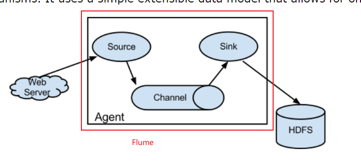
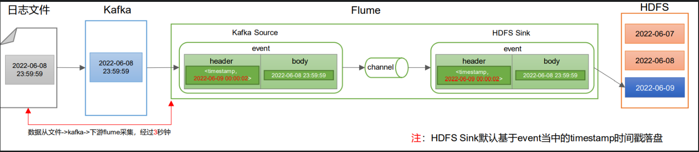
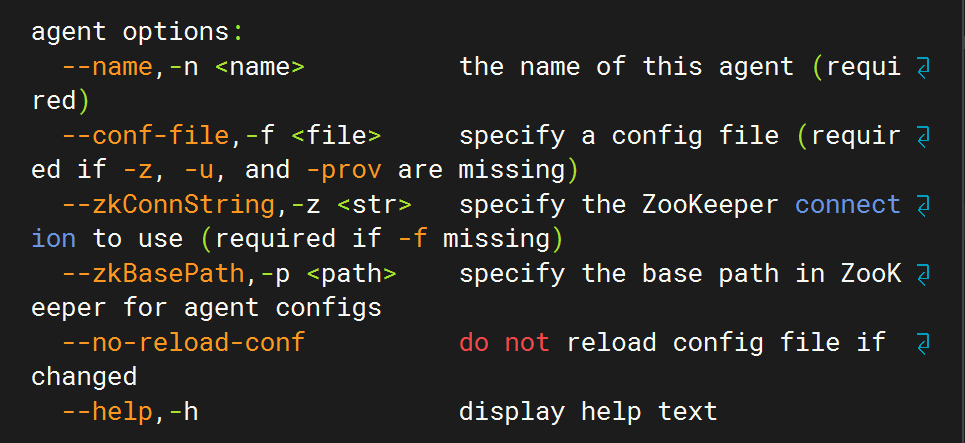

# Flume

Flume 官网：[Welcome to Apache Flume — Apache Flume](https://flume.apache.org/)

Flume 下载地址：[Download — Apache Flume](https://flume.apache.org/download.html)

## Flume 概念

### Flume 是什么？

高可用，高可靠的分布式日志收集系统。

### Flume 的主要作用

### Flume 的基础架构


Flume 的组成：

**Agent：** 是一个 JVM 进程，以事件的形式将数据从源头送至目的地。

**Source：** 接收数据到 Flume Agent 的组件，可以处理各种类型的日志数据。

**Channel：** 位于 Source 和 Sink 之间的缓冲区，**线程安全**的，所以 Source 和 Sink 可以运行在不同速率上。Flume 自带的 Channel 有以下几种：

- Memory Channel：将数据存在内存中，速度快，可靠性差
- File Channel：将数据写入文件中，可靠性高，速度慢
- Kafka Channel：可靠性高（基于磁盘），传输速度快 Kafka Channel > Memory Channel + Kafka Sink 因为**省去了 Sink 阶段**。

**Sink：** 从 Channel 中读取数据，发送到目的地。
**Sink：** 不断的轮训 Channel 中的事件，并将这些事件写入到下游（存储系统，索引系统或者下一个 Flume Agent），并将 Channel 中的事件删除。

**Event：** Flume 传输的基本单元，由 Header 和 Body 组成，Header 存放一写 event 的属性，k-v 结构，Body 存放数据，字节数组。


总结：

1. Flume 是一个日志收集系统，主要用于数据收集，数据传输，数据存储。
2. Flume 的 Agent 由 Source，Channel，Sink 三个组件组成。
3. Flume 传输的基本单元是 Event
   - Header 存放 event 的属性，k-v 结构
   - Body 存放数据，字节数组
4. Source 负责将数据源的数据发送到 Channel。
5. Channel 负责存储 Source 发送过来的数据，直到 Sink 处理完数据。

- Memory Channel：将数据存在内存中，速度快，可靠性差
- File Channel：将数据写入文件中，可靠性高，速度慢
- Kafka Channel：可靠性高（基于磁盘），传输速度快 Kafka Channel > Memory Channel > Kafka Sink 因为**省去了 Sink 阶段**。

6. Sink 负责将 Channel 中的数据发送到数据目的地。

## Flume 的安装与配置

Flume 官网地址：[Welcome to Apache Flume — Apache Flume](http://flume.apache.org/ "Welcome to Apache Flume — Apache Flume")

文档查看地址：[Flume 1.11.0 User Guide — Apache Flume](http://flume.apache.org/FlumeUserGuide.html "Flume 1.11.0 User Guide — Apache Flume")

下载地址：[http://archive.apache.org/dist/flume/](http://archive.apache.org/dist/flume/)

正常安装后修改 conf 目录下的 log4j2.xml 文件，修改如下两个参数。

```xml
<!--设置日志路径-->
<Property name="LOG_DIR">/opt/module/flume/logs</Property>

<AppenderRef ref="LogFile" />
<!--添加控制台输出方便查看-->
<AppenderRef ref="Console"/>
```

## Flume 拦截器

### Flume 拦截器是什么？

Flume 拦截器是 Flume 0.9.0 版本之后提供的一个功能，它可以在数据发送到目的地之前对数据进行处理。拦截器**定义在 Source**上，可以修改或者丢弃事件。

### Host Interceptor

将运行 Agent 的 hostname 或者 IP 写到 headers 中

### 自定义拦截器

自定义拦截器的编写流程大致如下：

1. 继承自 Interceptor 接口，重写四个方法
2. initialize 初始化
3. `public Event intercept(Event event)`处理单个 Event
4. `public List<Event> intercept(List<Event> events)` 处理多个 Event

### 自定义时间拦截器

使用自定义的时间拦截器，用于解决零点漂移问题。

**零点漂移：** 即日志文件的生成时间与经过 Kafka 后，到达 Flume 的 Source 的时间有差异，由于最终存储到 HDFS 中采用了时间分区，所以会导致数据存储到错误的目录中。


**解决方法：**

1. 修改 Flume 的配置文件，在 Source 中添加`interceptors`，并指定自定义的时间拦截器
2. 编写拦截器，在拦截器中获取当前时间，并修改 Event 的 header 中的时间戳
3. 修改 Event 的 header 中的时间戳，使其与日志文件的生成时间一致
4. 修改 Event 的 header 中的时间戳，使其与日志文件的生成时间一致

所以我们可以通过编写自定义的时间拦截器，将 Source 中 Event 的 Header 中的时间替换为日志的生成时间。

首先，引入所需的依赖

```xml {18-20,23-25} showLineNumbers
<?xml version="1.0" encoding="UTF-8"?>
<project xmlns="http://maven.apache.org/POM/4.0.0"
         xmlns:xsi="http://www.w3.org/2001/XMLSchema-instance"
         xsi:schemaLocation="http://maven.apache.org/POM/4.0.0 http://maven.apache.org/xsd/maven-4.0.0.xsd">
    <modelVersion>4.0.0</modelVersion>

    <groupId>com.maoyan</groupId>
    <artifactId>flume-interceptor</artifactId>
    <version>1.0-SNAPSHOT</version>

    <properties>
        <maven.compiler.source>8</maven.compiler.source>
        <maven.compiler.target>8</maven.compiler.target>
        <project.build.sourceEncoding>UTF-8</project.build.sourceEncoding>
    </properties>
    <dependencies>
        <dependency>
            <groupId>org.apache.flume</groupId>
            <artifactId>flume-ng-core</artifactId>
            <version>1.11.0</version>
        </dependency>
        <dependency>
            <groupId>com.alibaba.fastjson2</groupId>
            <artifactId>fastjson2</artifactId>
            <version>2.0.46</version>
        </dependency>
    </dependencies>
</project>
```

创建`TimestampInterceptor`类，注意所在的包的路径，后面导入到 Flume 的时候会用到，这里的是在`com.maoyan.flume.flume.interceptor`包下

```java showLineNumbers
package com.maoyan.flume.flume.interceptor;

import com.alibaba.fastjson2.JSONObject;
import org.apache.flume.Context;
import org.apache.flume.Event;
import org.apache.flume.interceptor.Interceptor;
import java.nio.charset.StandardCharsets;
import java.util.Iterator;
import java.util.List;
import java.util.Map;

public class TimestampInterceptor implements Interceptor {

    @Override
    public void initialize() {

    }

    @Override
    public Event intercept(Event event) {
    //1、获取header和body的数据
    Map<String, String> headers = event.getHeaders();
    String log = new String(event.getBody(), StandardCharsets.UTF_8);

    try {
        //2、将body的数据类型转成jsonObject类型（方便获取数据）
        JSONObject jsonObject = JSONObject.parseObject(log);

        //3、header中timestamp时间字段替换成日志生成的时间戳（解决数据漂移问题）
        String ts = jsonObject.getString("ts");
        headers.put("timestamp", ts);

        return event;
    } catch (Exception e) {
        e.printStackTrace();
        return null;
    }
}

@Override
public List<Event> intercept(List<Event> list) {
    Iterator<Event> iterator = list.iterator();
    while (iterator.hasNext()) {
        Event event = iterator.next();
        if (intercept(event) == null) {
            iterator.remove();
        }
    }
    return list;
}

    @Override
    public void close() {

    }

    public static class Builder implements Interceptor.Builder {
        @Override
        public Interceptor build() {
            return new TimestampInterceptor();
        }

        @Override
        public void configure(Context context) {
        }
    }
}
```

然后将其打包，并放到 flume 的`lib`目录下，并在配置文件中配置自定义的时间拦截器：

```json
a1.sources.r1.interceptors.i1.type = com.atguigu.gmall.flume.interceptor.TimestampInterceptor$Builder
```

## Flume 案例

### 启动参数解析

使用如下命令可以查看 Flume 的启动参数

```bash
/opt/module/flume/bin/flume-ng agent --help
```



需要注意的几点如下：

1. 我们使用`agent`命令来启动 Flume，`agent`命令会启动一个 Flume Agent，并且启动一个 JVM 进程来运行这个 Agent。
2. `--conf-file`：指定 Flume 的配置文件路径。
3. `--name`：指定 Flume Agent 的名称。

常见的命令格式：

```bash
/opt/module/flume/bin/flume-ng agent --conf-file /opt/module/flume/data/test/<配置文件名称>.conf --name a1
```

:::warning
`--conf`：指定 Flume 的配置文件路径。但是这个命令是全局参数，所以在 agent 命令中无需使用！！！
:::

### 案例一：端口-->控制台

第一个案例的官方文档：[Flume 1.11.0 User Guide — Apache Flume](https://flume.apache.org/releases/content/1.11.0/FlumeUserGuide.html#starting-an-agent)

使用 Flume 监听一个端口，并且收集该端口的数据，打印到控制台。架构选择如下表格：
| Source | Channel | Sink |
| :--- | :----: | ---: |
| type：netcat | Memory Channel | logger |
| bind：localhost | | |
|port：44444||

使用瑞士军刀(NetCat)创建一个聊天房间，并发送消息。

安装 NetCat

```bash
yum install nc
```

创建房间

```bash
nc -lk 44444
```

新建一个终端加入房间

```bash
nc localhost 44444
```

然后就可以互相发消息了


创建 Flume 的配置文件，这里我将配置文件放到了 Flume 的 demo 目录下了

```bash
mkdir -p ./demo/v1
cd ./demo/v1
vim nc-flume-console.conf
```

写入配置文件

```properties showLineNumbers
# example.conf: A single-node Flume configuration

# Name the components on this agent
a1.sources = r1
a1.sinks = k1
a1.channels = c1

# Describe/configure the source
a1.sources.r1.type = netcat
a1.sources.r1.bind = localhost
a1.sources.r1.port = 44444

# Describe the sink
a1.sinks.k1.type = logger

# Use a channel which buffers events in memory
a1.channels.c1.type = memory
a1.channels.c1.capacity = 1000
a1.channels.c1.transactionCapacity = 100

# Bind the source and sink to the channel
a1.sources.r1.channels = c1
a1.sinks.k1.channel = c1
```

配置文件解析：

- a1：就是 Agent，在启动的时候会创建一个 Agent，并且启动一个 JVM 进程来运行这个 Agent，并设置了 a1 的 source 为 r1，channel 为 c1，sink 为 k1
- a1.sources.r1 即对 source 进行配置，其他的同理
- 最后 source 和 sink 需要连接 channel，所以需要`a1.sources.r1.channels = c1`和`a1.sinks.k1.channel = c1`。

启动 Flume

```bash
/opt/module/flume/bin/flume-ng agent --conf-file /opt/module/flume/data/test/test_nc_console.conf  --name a1
```

:::tip
需要指定配置文件以及 Agent 的名称。
:::

另外一个终端启动 NetCat 监听 44444 端口

```bash
nc localhost 44444
```


可以看到，netcat 发送消息，flume 中会打印出来。

### 案例二：日志文件-->控制台

监听整个目录的实时追加文件，并输出到控制台。

所以，我们使用的 Source 为`TailDir Source`，Channel 为 Memory Channel，Sink 为 logger。

配置文件如下：

```properties
# Name the components on this agent
a1.sources = r1
a1.sinks = k1
a1.channels = c1

# Describe/configure the source
a1.sources.r1.type = TAILDIR
# 定义f1变量
a1.sources.r1.filegroups = f1
# 给f1变量赋值
a1.sources.r1.filegroups.f1 = /opt/module/flume/files/.*
# 偏移量文件（定位文件）
a1.sources.r1.positionFile = /opt/module/flume/taildir_position.json

# Describe the sink
a1.sinks.k1.type = logger

# Use a channel which buffers events in memory
a1.channels.c1.type = memory
a1.channels.c1.capacity = 1000
a1.channels.c1.transactionCapacity = 100

# Bind the source and sink to the channel
a1.sources.r1.channels = c1
a1.sinks.k1.channel = c1
```

:::warning
在文件中追加信息使用如下的命令

```bash
echo <追加内容> >> <文件名>
```

而不要使用`vim`，vim 的原理是将文件删除，再创建一个新的，所以文件的 iNode 值会改变，所以 Flume 将其认为是新文件。
:::

### 案例三：日志文件-->HDFS

```properties
a1.sources = r1
a1.sinks = k1
a1.channels = c1

# Describe/configure the source
a1.sources.r1.type = TAILDIR
# 定义f1变量
a1.sources.r1.filegroups = f1
# 给f1变量赋值
a1.sources.r1.filegroups.f1 = /opt/module/car-data/data/data.*
# 偏移量文件（定位文件）
a1.sources.r1.positionFile = /opt/module/flume/taildir-files/car_taildir_position.json

# 配置 Channel
a1.channels.c1.type = file
a1.channels.c1.checkpointDir = /opt/module/flume/checkpoint/behavior1
a1.channels.c1.dataDirs = /opt/module/flume/data/behavior1
a1.channels.c1.maxFileSize = 2146435071
a1.channels.c1.capacity = 1000000
a1.channels.c1.keep-alive = 6

# 配置 Sink (HDFS)
a1.sinks.k1.type = hdfs
a1.sinks.k1.hdfs.path = /origin_data/car_data_full/2024-08-25
a1.sinks.k1.hdfs.filePrefix = log
a1.sinks.k1.hdfs.round = false
a1.sinks.k1.hdfs.rollInterval = 30
a1.sinks.k1.hdfs.rollSize = 134217728
a1.sinks.k1.hdfs.rollCount = 0
a1.sinks.k1.hdfs.fileType = CompressedStream
a1.sinks.k1.hdfs.codeC = gzip

# Bind the source and sink to the channel
a1.sources.r1.channels = c1
a1.sinks.k1.channel = c1
```

### 案例四：端口-->Kafka

```properties
# 定义组件名称
agent.sources = netcatSource
agent.channels = kafkaChannel

# 配置 Source （NetCat）
agent.sources.netcatSource.type = netcat
agent.sources.netcatSource.bind = localhost
agent.sources.netcatSource.port = 44444

# 配置 Channel （Kafka channel）
agent.channels.kafkaChannel.type = org.apache.flume.channel.kafka.KafkaChannel
agent.channels.kafkaChannel.kafka.bootstrap.servers = localhost:9092
agent.channels.kafkaChannel.kafka.topic = car-data
agent.channels.kafkaChannel.parseAsFlumeEvent = false

# 组装
agent.sources.netcatSource.channels = kafkaChannel
```

启动 Kafka 消费者

```bash
/opt/module/kafka/bin/kafka-console-consumer.sh  --bootstrap-server localhost:9092 --topic car-data
```

启动 Flume

```bash
/opt/module/flume/bin/flume-ng agent --name agent --conf-file /opt/module/flume/data/test/test_nc_kafka.conf
```

### 案例五：日志文件-->Kafka

传递到 Kafka 中，我们可以使用`Kafka Channel`，从而可以省略 Sink 阶段，提高传输效率。

```properties
#定义组件
a1.sources = r1
a1.channels = c1

# 配置 Source
a1.sources.r1.type = TAILDIR
# 定义f1变量
a1.sources.r1.filegroups = f1
# 给f1变量赋值
a1.sources.r1.filegroups.f1 = /opt/module/car-data/data/data.*
# 偏移量文件（定位文件）
a1.sources.r1.positionFile = /opt/module/flume/taildir-files/car_taildir_position.json

# 配置 Channel
a1.channels.c1.type = org.apache.flume.channel.kafka.KafkaChannel
a1.channels.c1.kafka.bootstrap.servers = localhost:9092
a1.channels.c1.kafka.topic = car-data
a1.channels.c1.parseAsFlumeEvent = false
#组装
a1.sources.r1.channels = c1
```

启动 Kafka 消费者

```bash
/opt/module/kafka/bin/kafka-console-consumer.sh  --bootstrap-server localhost:9092 --topic car-data
```

启动 Flume

```bash
/opt/module/flume/bin/flume-ng agent -n a1 -f /opt/module/flume/data/car/car_log_kafka.conf
```

### 案例六：Kafka-->控制台

```properties
a1.sources = r1
a1.channels = c1

# 配置 Source (Kafka)
a1.sources.r1.type = org.apache.flume.source.kafka.KafkaSource
a1.sources.r1.kafka.bootstrap.servers = localhost:9092
a1.sources.r1.kafka.topic = car-data
a1.sources.r1.kafka.auto.offset.reset = earliest

# 配置 Channel
a1.channels.c1.type = file
a1.channels.c1.checkpointDir = /opt/module/flume/checkpoint/behavior1
a1.channels.c1.dataDirs = /opt/module/flume/data/behavior1
a1.channels.c1.maxFileSize = 2146435071
a1.channels.c1.capacity = 1000000
a1.channels.c1.keep-alive = 6

# 配置 Sink (Logger)
a1.sinks.k1.type = logger

# 组装
a1.sources.r1.channels = c1
a1.sinks.k1.channel = c1
```

```bash
/opt/module/flume/bin/flume-ng agent -n a1 -f /opt/module/flume/data/test/test_kafka_console.conf
```

### 归纳常用的配置

#### Source

**Netcat Source**

```properties
a1.sources = r1
a1.sources.r1.type = netcat
a1.sources.r1.bind = localhost
a1.sources.r1.port = 44444
```

**Kafka Source**

```properties
a1.sources = r1
a1.sources.r1.type = org.apache.flume.source.kafka.KafkaSource
a1.sources.r1.kafka.bootstrap.servers = localhost:9092
a1.sources.r1.kafka.topic = <topic>
a1.sources.r1.kafka.auto.offset.reset = earliest
```

**TailDir Source**

```properties
a1.sources = r1
a1.sources.r1.type = TAILDIR
a1.sources.r1.filegroups = f1
a1.sources.r1.filegroups.f1 = /opt/module/car-data/data/data.*
a1.sources.r1.positionFile = /opt/module/flume/taildir_position.json
```

#### Channel

**Memory Channel**

```properties
a1.channels = c1
a1.channels.c1.type = memory
a1.channels.c1.capacity = 1000000
a1.channels.c1.transactionCapacity = 1000
```

**Kafka Channel**

```properties
a1.channels = c1
a1.channels.c1.type = org.apache.flume.channel.kafka.KafkaChannel
a1.channels.c1.kafka.bootstrap.servers = localhost:9092
a1.channels.c1.kafka.topic = car-data
a1.channels.c1.parseAsFlumeEvent = false
```

**File Channel**

```properties
a1.channels = c1
a1.channels.c1.type = file
a1.channels.c1.checkpointDir = /opt/module/flume/checkpoint/behavior1
a1.channels.c1.dataDirs = /opt/module/flume/data/behavior1
a1.channels.c1.maxFileSize = 2146435071
a1.channels.c1.capacity = 1000000
a1.channels.c1.keep-alive = 6
```

#### Sink

**Logger Sink**

```properties
a1.sinks = k1
a1.sinks.k1.type = logger
```

**HDFS Sink**

```properties
a1.sinks = k1
a1.sinks.k1.type = hdfs
a1.sinks.k1.hdfs.path = /origin_data/car_data_full/2024-08-25
a1.sinks.k1.hdfs.filePrefix = log
a1.sinks.k1.hdfs.round = false
a1.sinks.k1.hdfs.rollInterval = 30
a1.sinks.k1.hdfs.rollSize = 134217728
a1.sinks.k1.hdfs.rollCount = 0
a1.sinks.k1.hdfs.fileType = CompressedStream
a1.sinks.k1.hdfs.codeC = gzip
```

## 脚本

```bash
#!/bin/bash

if [ -z "$1" ]; then
    echo "错误: 没有输入操作类型 (start/stop)"
    echo "Usage: $0 {start|stop} <conf-file>"
    exit 1
fi

if [ "$1" == "start" ] && [ -z "$2" ]; then
    echo "错误: 启动时没有输入配置文件"
    echo "Usage: $0 {start|stop} <conf-file>"
    exit 1
fi

case $1 in
    "start")
        echo "启动 Flume..."
        nohup /opt/module/flume/bin/flume-ng agent --conf-file $2 --name agent >/dev/null 2>&1 &
        ;;
    "stop")
        echo "停止 Flume..."
        ps -ef | grep flume | grep -v grep | awk '{print $2}' | xargs kill -9
        ;;
    *)
        echo "错误: 无效的操作类型"
        echo "Usage: $0 {start|stop} <conf-file>"
        exit 1
        ;;
esac
```
