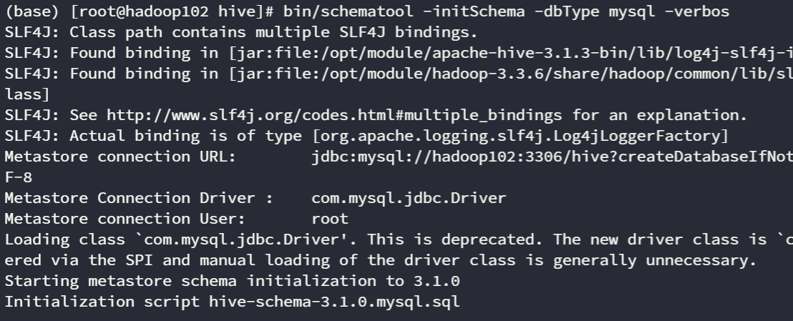
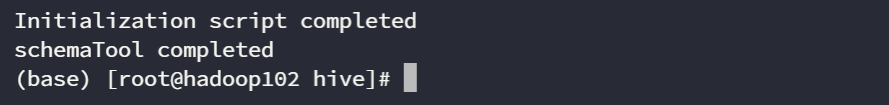

# Hive 概述

# Hive 架构

# Hive 安装

Hive下载：[Hive3.1.3](https://dlcdn.apache.org/hive/hive-3.1.3/)

Mysql驱动包：[mysql-connector-java](https://repo1.maven.org/maven2/mysql/mysql-connector-java/)

官网：[hive.apache.org/](https://hive.apache.org/)

官方文档：[GettingStarted - Apache Hive - Apache Software Foundation](https://cwiki.apache.org/confluence/display/Hive/GettingStarted "GettingStarted - Apache Hive - Apache Software Foundation")

## 初始化元数据库
在启动Hive之前，以及**更改了Hive的配置文件之后**，需要初始化Hive所需的元数据库。

在Mysql中新建一个数据库：hive

```sql
CREATE DATABASE hive CHARSET utf8mb4;
```

执行元数据库初始化的命令：

```bash
cd /opt/module/hive
bin/schematool -initSchema -dbType mysql -verbos
```




## 启动并连接 Hive
Hive 的数据本质上是保存在 HDFS 中的，所以要确保 Hive 的用户尽量与 HDFS 的用户一致，使得 Hive 有权限访问 HDFS 中的数据。创建一个hive的日志文件夹：

```bash
mkdir /opt/module/hive/logs
```

启动 Hive 的元数据管理服务，有`前台启动`和`后台启动`两种方式：

```bash
# 前台启动
bin/hive --service metastore

# 后台启动
nohup bin/hive --service metastore > /opt/module/hive/logs/metastore.log 2>&1 &
```

当 Hive 的元数据管理服务启动后，就可以启动 Hive 的客户端了，同样的也有两种方式，一种是在本地直接启动，还有一种是通过`Hive ThriftServer`使得可以通过第三方的客户端连接到 Hive 数据库。
```bash
# Hive Shell方式
bin/hive

# Hive ThriftServer方式
bin/hive --service hiveserver2
```

<Callout type="info">
当使用第三方的工具，例如`DataGrip`连接Hive时，只需要输入 Hive 的用户名即可，无需输入密码。
</Callout>

## Hive on Spark

Hive 有多种的执行引擎，例如`MapReduce`、`Tez`、`Spark`等，默认使用的执行引擎是`MapReduce`，但是我们可以通过配置文件来修改默认的执行引擎。

<Callout type="warning">
**兼容性说明：** 官网下载的Hive3.1.3和Spark3.3.1**默认是不兼容**的。因为Hive3.1.3支持的Spark版本是2.3.0，所以需要我们重新编译Hive3.1.3版本。也可以使用别人编译好的。

**编译步骤：** 官网下载Hive3.1.3源码，修改pom文件中引用的Spark版本为3.3.1，如果编译通过，直接打包获取jar包。如果报错，就根据提示，修改相关方法，直到不报错，打包获取jar包。
</Callout>

下载-->[spark.apache.org/downloa...](http://spark.apache.org/downloads.html)，并解压`spark-3.3.1-bin-without-hadoop.tgz`到`/opt/module`目录下，更名为`/opt/module/spark`

**修改Spark配置文件：**

修改文件名

```bash
mv /opt/module/spark/conf/spark-env.sh.template /opt/module/spark/conf/spark-env.sh
```

增加如下内容

```shell
export SPARK_DIST_CLASSPATH=$(hadoop classpath)
```

**配置SPARK_HOME环境变量：**

```bash
sudo vim /etc/profile.d/spark_env.sh
```

```bash
export SPARK_HOME=/opt/module/spark
export PATH=$SPARK_HOME/bin:$PATH
```

刷新环境变量

```bash
source /etc/profile.d/spark_env.sh
```

**在Hive中创建配置文件：**

```bash
vim /opt/module/hive/conf/spark-defaults.conf
```

```conf
spark.master                               yarn
spark.eventLog.enabled                   true
spark.eventLog.dir                        hdfs://hadoop102:8020/spark-history
spark.executor.memory                    1g
spark.driver.memory					     1g
```

在HDFS创建如下路径，用于存储历史日志。

```bash
hadoop fs -mkdir /spark-history
```

**向HDFS上传Spark纯净版jar包：**

- 采用Spark纯净版jar包，不包含hadoop和hive相关依赖，能避免依赖冲突。
- Hive任务最终由Spark来执行，Spark任务资源分配由Yarn来调度，该任务有可能被分配到集群的任何一个节点。所以需要将Spark的依赖上传到HDFS集群路径，这样集群中任何一个节点都能获取到。

```bash
hadoop fs -mkdir /spark-jars
hadoop fs -put /opt/module/spark/jars/\* /spark-jars
```

**修改Hive配置文件：**

```bash
vim /opt/module/hive/conf/hive-site.xml
```

添加如下内容

```xml
<!--Spark依赖位置（注意：端口号8020必须和namenode的端口号一致）-->
<property>
    <name>spark.yarn.jars</name>
    <value>hdfs://hadoop102:8020/spark-jars/*</value>
</property>
  
<!--Hive执行引擎-->
<property>
    <name>hive.execution.engine</name>
    <value>spark</value>
</property>
```

# 序列化机制
既然 Hive 保存的数据是在 HDFS 中，那么就涉及到了文件的序列化机制。这个机制是 Hive 能够灵活处理各种数据格式的基石，其核心概念就是 SerDe。SerDe 是 `Serializer` (序列化器) 和 `Deserializer` (反序列化器) 的合成词。它是一个 Java 库，充当了 Hive 与存储在 HDFS 上多样化数据格式之间的“翻译官”或“适配器”。简单来说，SerDe 告诉 Hive 两件关键的事情：

1. **如何读取数据 (Deserialization - 反序列化):** 当 Hive 需要查询数据时，Deserializer 负责将存储在 HDFS 文件中的字节流（无论是文本、JSON、CSV 还是二进制格式）转换成 Hive 内部能够理解和处理的、具有结构化列的行对象（Row Object）。
2. **如何写入数据 (Serialization - 序列化):** 当 Hive 需要将查询结果或数据写入 HDFS 文件时，Serializer 负责将 Hive 内部的行对象转换成目标文件格式所要求的特定字节流。

<Sidenote>
每个 Hive 表在定义时都必须关联一个 SerDe。如果你在 `CREATE TABLE` 语句中不明确指定，Hive 会使用一个默认的 SerDe（通常是用于处理纯文本文件的 `LazySimpleSerDe`）。
</Sidenote>

例如下面的代码，创建表时配置指定的`SerDe`:
```sql showLineNumbers {9}
CREATE TABLE IF NOT EXISTS user_behavior (
    user_id STRING,
    item_id STRING,
    category_id INT,
    behavior STRING,
    timestamp BIGINT
)
-- 指定行格式，包括字段分隔符和序列化器
ROW FORMAT SERDE 'org.apache.hadoop.hive.serde2.lazy.LazySimpleSerDe'
WITH SERDEPROPERTIES (
    'field.delim' = '\t',               -- 字段分隔符
    'serialization.format' = '\t',      -- 序列化格式分隔符
    'escape.delim' = '\\'               -- 转义字符
)
```
我们可以看到`SerDe`的配置是在`ROW FORMAT`语法中配置的，而`ROW FORMAT`语法就是用于指定行格式，包括字段分隔符和序列化器。

# 内/外部表
在 Hive 中，内外部表（Managed Table 和 External Table）是两种不同的数据管理方式，主要区别在于数据的所有权和生命周期管理。默认使用`CREATE TABLE`语法创建的表是`Managed Table`，而使用`CREATE EXTERNAL TABLE`语法创建的表是`External Table`。内/外部表的主要区别在于：

|区别|内部表|外部表|
|---|---|---|
|**数据所有权**|Hive 完全管理表的数据和元数据|Hive 仅管理元数据，数据由用户或其他系统管理|
|**数据存储位置**|默认存储在 Hive 的仓库目录（`hive.metastore.warehouse.dir`，通常是 `/user/hive/warehouse/`）下，以表名创建文件夹|通过 `LOCATION` 关键字指定数据存储路径，可位于 HDFS、本地文件系统等|
|**数据导入**|可以使用`insert`语句向内部表中插入数据|将数据存储在外部的文件系统，再通过`LOAD DATA`语句将数据导入到Hive中|
|**删除操作**|删除表（DROP TABLE）时，会**同时删除元数据和实际数据**|删除表（DROP TABLE）时，仅删除元数据，**实际数据不会被删除**|
|**适用场景**|内部表适合存储对数据的修改和删除操作，因为删除内部表可以直接删除相关的数据文件，一般内部表在数仓的`DW`层中使用|外部表适合存储对数据的只读操作，比如将已经存在的数据文件导入到Hive中进行分析。一般外部表在数仓中的`ODS`层中使用|

# 分区表

# 分桶表

