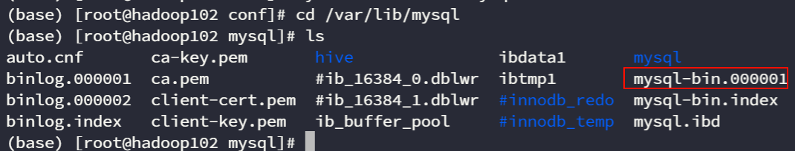
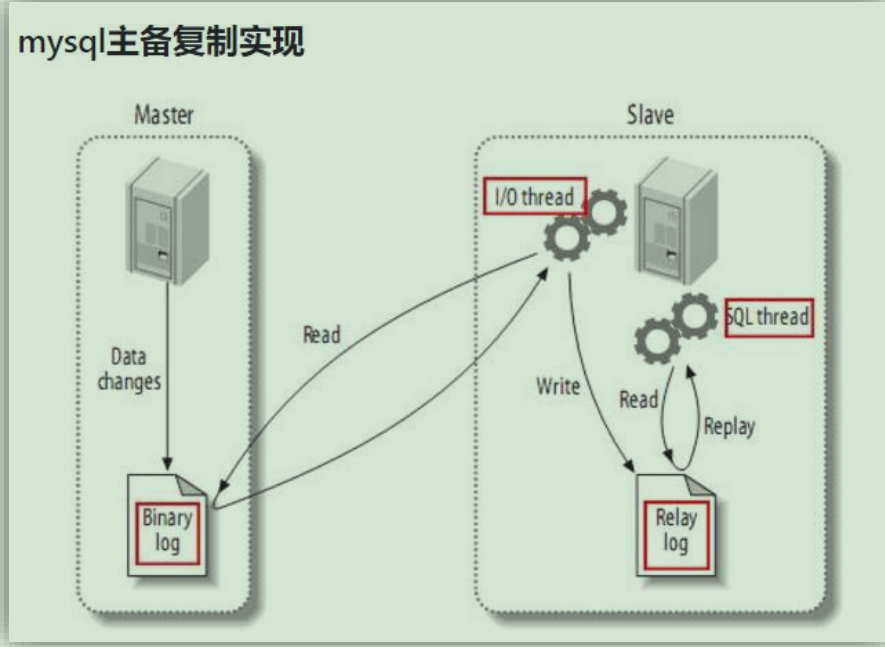
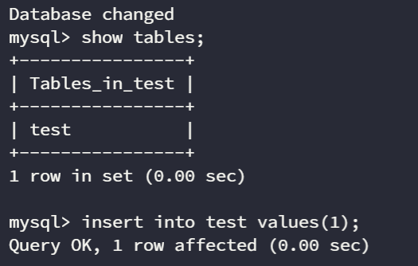
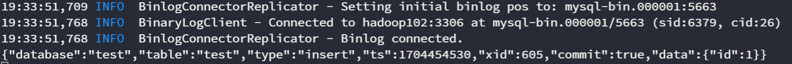

官网：[Maxwell&apos;s Daemon](https://maxwells-daemon.io/)

Quick Start：[maxwells-daemon.io/quick...](https://maxwells-daemon.io/quickstart/)

# 概念

Maxwell是一个用于MySQL数据库的开源数据变更捕获工具。它的主要作用是**监控MySQL数据库的变更，捕获这些变更并将它们以易于处理的格式发送到其他系统**，例如消息队列或文件。这有助于实现实时数据同步、日志分析等应用场景。抓取Mysql的变更数据，封装为json格式，再发送给Kafka消息队列。

# Maxwell 原理

Maxwell 通过读取 MySQL 的 `binlog` 文件从而监控 Mysql 的数据变更，再将这些数据变更发送到下游，从而实现了数据同步，所以在了解 Maxwell 的原理之前我们需要先了解 MySQL的主从复制原理。

## MySQL 的 binlog

`binlog` 记录了所有的 DDL 和 DML(除了数据查询语句)语句，以事件形式记录，还包含语句所执行的消耗的时间，MySQL 的二进制日志是事务安全型的。
## binlog 的分类
mysql binlog 的格式有三种，分别是 `STATEMENT`,`MIXED`和`ROW。`
- `STATEMENT`：binlog 会**记录每次一执行写操作的语句**，相对 row 模式节省空间，但是可能产生不一致性。<Sidenote>例如`now()`方法，在主从复制中，都执行now()方法，但是值不相同。</Sidenote>
- `ROW`：binlog 会记录每次操作后每行记录的变化，占用空间较大。
- `MIXED`：节省空间，同时兼顾了一定的一致性
如下是一个配置文件的示例：
```properties showLineNumbers {4}
[mysqld]
server_id=1
log-bin=mysql-bin
binlog_format=row
# 启用binlog的数据库，需根据实际情况作出修改
binlog-do-db=<数据库名>
```

## 开启 binlog
**开启`binlog`的方法：** 找到MySQL的配置文件`/etc/my.cnf`，在`[mysqld]`块中添加`log-bin=mysql-bin` 从而开启 MySQL 的 binlog 功能。

但是有一些工程师是将 MySQL 装在了Docker 容器中，那么我们可以通过如下的方法去开启 Docker 容器中的 MySQL 的 binlog。首先进入到mysql容器中，并在容器中安装vim用于编辑文件。
```shell
# 进入Mysql容器
docker exec -it my-mysql bash
# 安装
```
编辑MySQL的配置文件，一般为`/etc/mysql/conf.d/mysqld.cnf`或者`/etc/mysql/my.cnf`。在`[mysqld]`块中添加如下的配置
```shell
log-bin=mysql-bin
```
当开启`binlog`后，我们需要去检验`binlog`是否已经开启了，进入 MySQL中
```shell
mysql -uroot -p<password>
```
输入如下的命令检查是否开启binlog
```sql
show variables like 'log_bin';
```
显示`ON`即为开启状态。

当配置完成之后，可以通过`systemctl restart mysqld`命令重启一下 `MySQL` 数据库，在`/var/lib/mysql`路径下，可以看到`mysql-bin.000001`文件


## MySQL 主从复制原理


1. Master 主库将改变记录，写到二进制日志(binary log)中
2. Slave 从库向 mysql master 发送 dump 协议，将 master 主库的binary log events 拷贝到它的中继日志(relay log)；
3. Slave 从库读取并重做中继日志中的事件，将改变的数据同步到自己的数据库。

<Callout type="warning">
主库先执行变更操作，再将日志写入到Binlog文件中。这样的话对于`事务`没有执行成功的话，就不会有变更日志被写入到`binlog`文件中，这样也就不会被传递到下游。
</Callout>

## Maxwell 的工作原理

Maxwell 的工作原理很简单，就是把自己伪装成 MySQL 的一个 slave，然后以 slave的身份假装从 MySQL(master)复制数据。

# Maxwell 的安装与配置
先决条件是已经开启并配置完成 MySQL 的 binlog 日志记录，那么就可以进行安装与配置 Maxwell了。在此之前，我们还需要去创建一个 Maxwell 的元数据库。
## 创建 Maxwell 元数据库
创建一个 Maxwell 元数据库
```sql
create database maxwell;
```
设置密码级别
```sql
set global validate_password_length=4;
set global validate_password_policy=0;
```
分配一个账号可以操作maxwell数据库
```sql
CREATE USER 'maxwell'@'%' IDENTIFIED BY 'maxwell'
GRANT ALL ON maxwell.* TO 'maxwell'@'%';
GRANT SELECT, REPLICATION CLIENT, REPLICATION SLAVE ON *.* TO 'maxwell'@'%';
```
最后刷新一下 MySQL 表的权限
```sql
flush privileges;
```

## 启动 Maxwell

有两种启动方式，分别是使用命令行启动，还有一种是修改`Maxwell`的配置文件，然后定制化的启动Maxwell，但是实际本质上都是一致的，启动脚本会接受参数，命令行启动相当于手动传递参数进去，而修改配置文件启动，相当于先配置好参数再直接启动。

**使用命令行启动：** 在`Maxwell`的根目录下，执行
```shell
bin/maxwell --user='maoyan' --password='123456' --host='hadoop102' --producer=stdout
```
**参数解析：**
1. `user`：Mysql的用户名
2. `password`：Mysql的密码
3. `host`：Mysql安装的主机名称
4. `producer`：生产者模式(stdout：控制台 kafka：kafka 集群)

**使用配置文件启动：** 将 config 子目录下的例子配置文件拷贝到根目录再启动
```shell
cp config.properties.example config.properties
bin/maxwell --config ./config.properties
```
# Maxwell 启停脚本
一个可以方便启停`Maxwell`的脚本
```shell showLineNumbers
#!/bin/bash

MAXWELL_HOME=/opt/module/maxwell

status_maxwell(){
    result=`ps -ef | grep com.zendesk.maxwell.Maxwell | grep -v grep | wc -l`
    return $result
}


start_maxwell(){
    status_maxwell
    if [[ $? -lt 1 ]]; then
        echo "启动Maxwell"
        $MAXWELL_HOME/bin/maxwell --config $MAXWELL_HOME/config.properties --daemon
    else
        echo "Maxwell正在运行"
    fi
}


stop_maxwell(){
    status_maxwell
    if [[ $? -gt 0 ]]; then
        echo "停止Maxwell"
        ps -ef | grep com.zendesk.maxwell.Maxwell | grep -v grep | awk '{print $2}' | xargs kill -9
    else
        echo "Maxwell未在运行"
    fi
}


case $1 in
    start )
        start_maxwell
    ;;
    stop )
        stop_maxwell
    ;;
    restart )
       stop_maxwell
       start_maxwell
    ;;
esac
```

# Maxwell 的案例
## MySQL CDC --> 控制台
运行Maxwell来监听MySQL的变化
```shell
bin/maxwell --user='root' --password='000000' --host='hadoop102' --producer=stdout
```

变更`test`表中的内容
```sql
insert into test values(1);
```



可以看到Maxwell的控制台的输出



# 数据同步
## 增量数据同步
首先启动完成 `Kafka` 服务器后，修改 `Maxwell` 的配置文件 `vim /opt/module/maxwell/config.properties`
```properties
#Maxwell数据发送目的地，可选配置有stdout|file|kafka|kinesis|pubsub|sqs|rabbitmq|redis
producer=kafka
# 目标Kafka集群地址
kafka.bootstrap.servers=hadoop102:9092,hadoop103:9092,hadoop104:9092
#目标Kafka topic，可静态配置，例如:maxwell，也可动态配置，例如：%{database}_%{table}
kafka_topic=topic_db

# MySQL相关配置
host=hadoop102
user=maxwell
password=maxwell
jdbc_options=useSSL=false&serverTimezone=Asia/Shanghai&allowPublicKeyRetrieval=true

# 过滤gmall中的z_log表数据，该表是日志数据的备份，无须采集
filter=exclude:gmall.z_log
# 指定数据按照主键分组进入Kafka不同分区，避免数据倾斜
producer_partition_by=primary_key
```
再使用自定义的配置文件进行启动 Maxwell 即可。
## 全量数据同步
有时只有增量数据是不够的，我们可能需要使用到MySQL数据库中从历史至今的一个完整的数据集。这就需要我们在进行增量同步之前，先进行一次历史数据的全量同步。这样就能保证得到一个完整的数据集。所以我们可以使用 `Maxwell-bootstrap` 来在增量数据同步之前进行一个全量数据同步。
```shell
/opt/module/maxwell/bin/maxwell-bootstrap --database gmall --table user_info --config /opt/module/maxwell/config.properties
```
**参数解析：**
- --database gmall：数据库名称
- --table user_info：数据表名称
输出格式如下：
```json showLineNumbers {4,29}
{
    "database": "fooDB",
    "table": "barTable",
    "type": "bootstrap-start",
    "ts": 1450557744,
    "data": {}
}
{
    "database": "fooDB",
    "table": "barTable",
    "type": "bootstrap-insert",
    "ts": 1450557744,
    "data": {
        "txt": "hello"
    }
}
{
    "database": "fooDB",
    "table": "barTable",
    "type": "bootstrap-insert",
    "ts": 1450557744,
    "data": {
        "txt": "bootstrap!"
    }
}
{
    "database": "fooDB",
    "table": "barTable",
    "type": "bootstrap-complete",
    "ts": 1450557744,
    "data": {}
}
```
<Callout type="info">
第一个 `bootstrap-start` 和最后一个 `bootstrap-complete` 仅仅作为开始和结束的标志，不包含数据，中间的类型才包含数据。
</Callout>

# Maxwell 与 DataX 的对比 *

这是一个面试官经常会问到的问题，所以是一个需要理解的重点，我们可以从`实现原理`，`数据处理模式`，`数据格式`以及`数据形态`这几个角度来进行分析。

| 特性         | Maxwell                                                                           | DataX                                                                                                                   |
| ------------ | --------------------------------------------------------------------------------- | ----------------------------------------------------------------------------------------------------------------------- |
| **实现原理**     | 伪装成一个 MySQL 的 `Slave` 从库，通过解析数据库的二进制日志（Binlog）来捕获增量数据变更。 | 采用 `Framework + Plugin` 架构。通过 Reader 插件从源端读取数据，经过内部数据通道（Channel），再由 Writer 插件写入目标端。 |
| **数据处理模式** | `流式处理（Streaming）`。持续不断地监听和发布变更事件。                             | `批处理（Batch）`。以任务（Job）为单位，一次性处理和迁移指定范围内的大量数据。                                            |
| **数据形态**     | 主要处理`增量数据`变更事件（DML 操作）。                                            | 主要处理`全量数据`，也可以通过配置实现增量数据的抽取（通常依赖时间戳或主键）。                                            |
| **数据格式**     | 通常输出为标准化的 `JSON` 格式，包含了数据变更前后的值、操作类型、事务信息等。      | 内部有`统一的数据抽象`，对用户透明。支持不同数据源之间的数据类型自动映射和转换。                                          |

export const MaxwellQuizData = [
  {
    question: "Maxwell 捕获 MySQL 数据变更的核心原理是什么？",
    options: [
      "定期轮询扫描数据表，对比前后差异",
      "通过在每张表上创建触发器来监控变更",
      "将自己伪装成 MySQL 的从库（Slave），读取并解析二进制日志（binlog）",
      "直接分析 MySQL 的事务日志（redo log）"
    ],
    correctAnswer: "将自己伪装成 MySQL 的从库（Slave），读取并解析二进制日志（binlog）",
    explanation: "文章明确指出，Maxwell 的工作原理是把自己伪装成一个 MySQL slave，通过 dump 协议从 Master 获取 binlog 事件，从而实现对数据变更的实时捕获。这是一种非侵入式的方法，对源数据库的性能影响极小。"
  },
  {
    question: "为了确保数据捕获的准确性，尤其是在存在非确定性函数（如 NOW()）的情况下，MySQL 的 `binlog_format` 应首选哪种模式？",
    options: [
      "STATEMENT",
      "MIXED",
      "ROW",
      "BINARY"
    ],
    correctAnswer: "ROW",
    explanation: "文章中提到了 `STATEMENT` 模式的缺陷，即在主从复制中执行 `now()` 这样的函数可能导致数据不一致。`ROW` 模式则会记录每一行数据的具体变更内容，而不是仅仅记录执行的 SQL 语句，从而完美地避免了这类问题，保证了数据同步的精确性，是 CDC 场景下的最佳选择。"
  },
  {
    question: "根据文章中的对比，Maxwell 和 DataX 在数据处理模式上的主要区别是什么？",
    options: [
      "Maxwell 主要用于批处理（Batch），而 DataX 用于流式处理（Streaming）",
      "Maxwell 主要用于流式处理（Streaming），而 DataX 用于批处理（Batch）",
      "两者都只支持流式处理",
      "两者都只支持批处理"
    ],
    correctAnswer: "Maxwell 主要用于流式处理（Streaming），而 DataX 用于批处理（Batch）",
    explanation: "对比表格清晰地指出了两者的定位：Maxwell 通过持续监听 binlog 实现流式处理，用于捕获实时的增量数据变更。而 DataX 以任务为单位，设计用于一次性、大规模的全量数据迁移，是典型的批处理模式。理解这一点是为不同场景选择正确工具的关键。"
  },
  {
    question: "在启动增量同步之前，如果需要对某个已存在的表进行全量数据同步，应该使用 Maxwell 的哪个命令？",
    options: [
      "bin/maxwell --full-sync",
      "bin/maxwell-bootstrap",
      "bin/maxwell-import",
      "bin/maxwell --producer=bootstrap"
    ],
    correctAnswer: "bin/maxwell-bootstrap",
    explanation: "文章在“全量数据同步”部分专门介绍了 `maxwell-bootstrap` 工具。它用于在启动常规的增量同步之前，对指定的表进行一次性的历史数据抽取。输出的数据会带有 `bootstrap-start`、`bootstrap-insert` 和 `bootstrap-complete` 这样的特殊 `type` 字段，便于下游系统区分处理。"
  },
  {
    question: "为 Maxwell 创建 MySQL 用户时，除了需要其自身元数据数据库的 `ALL` 权限外，还需要在所有数据库（`*.*`）上授予哪一组核心权限？",
    options: [
      "SELECT, INSERT, UPDATE",
      "CREATE, DROP, ALTER",
      "FILE, PROCESS, SUPER",
      "SELECT, REPLICATION CLIENT, REPLICATION SLAVE"
    ],
    correctAnswer: "SELECT, REPLICATION CLIENT, REPLICATION SLAVE",
    explanation: "文章中的 SQL 授权语句 `GRANT SELECT, REPLICATION CLIENT, REPLICATION SLAVE ON *.* TO 'maxwell'@'%';` 明确了这一点。`REPLICATION SLAVE` 和 `REPLICATION CLIENT` 是 Maxwell 连接到 MySQL 并请求 binlog 的必要权限，而 `SELECT` 权限则用于在启动时读取表的元数据信息（如列名、数据类型等）。"
  }
];

# Maxwell 知识小测验

<QuizBar questions={MaxwellQuizData} />