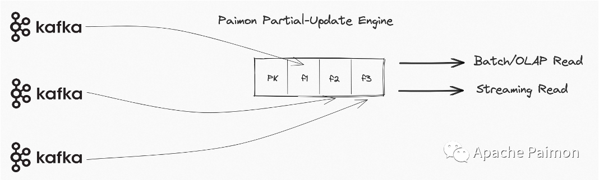

# 参考
[字节跳动 Paimon 实践](https://bytedance.larkoffice.com/docx/KXmVd2QIxo1H34xNymEc442HnZ0)

[Paimon 官方文档](https://paimon.apache.org/docs/0.8/)

# Paimon 数据湖是什么

Apache Paimon 是一项新的流式数据湖存储技术，通过创新性的结合 LSM-Tree 结构和湖格式，可以为用户提供高吞吐、低延迟的数据摄入、完整的流式变更订阅以及高效的 OLAP 查询能力，并同时支持 Flink 和 Spark 计算引擎进行流批加工。

# 核心能力


# 主键表与非主键表

Paimon 表的 主键表（Primary Key Table）和 非主键表（Non-Primary Key Table）是两种核心表类型，其设计目标和适用场景截然不同，核心区别体现在 `数据操作能力、存储架构、适用场景` 等方面。以下是具体对比：

**主键表：**
- 概念：通过 PRIMARY KEY 定义唯一标识记录的字段（或字段组合），支持对已有记录的 更新（UPDATE） 和 删除（DELETE）。即`有更新的需求`，例如订单表（状态变更：待支付→已完成）、用户信息表（修改手机号）等。
- 存储架构：

**非主键表：** 无主键定义，仅支持 插入（INSERT） 操作，不允许更新或删除已有记录（本质是 “仅追加” 模式）。类似传统的 `OLTP` 数据库中的表。例如常见的日志表等。

# 主键表
## 合并引擎
当 Paimon 接收器收到两条或多条具有相同主键的记录时，它会将它们合并为一条记录，以保持主键的唯一性。通过指定 merge-engine 表属性，用户可以选择如何合并记录。主要包含的合并引擎有以下几种：
1. 重复删除（deduplicate）
2. 部分列更新（Partial-Update）
3. 聚合（aggregation）
4. 首行数据

<Callout type="info">
实际上，上面的三种方式都是合并的方式，通俗点来说就是看数据是否为`同一个主键`，如果是同一个`同一个主键`则该如何合并的问题，当然每一行都有许多的字段，所以我们也可以自定义每个列该如何的合并。
</Callout>

### 重复删除（deduplicate）

deduplicate 合并引擎是`默认的合并引擎`，Paimon 只会保留最新的记录，并丢弃其他具有相同主键的记录。具体来说，如果最新一条记录是 DELETE 记录，则所有主键相同的记录都会被删除。可以配置 `ignore-delete` 来忽略它。

### 部分列更新
部分列更新是指直接更新表中某些字段值，而不是全部字段值。Paimon 通过Partial Update合并引擎来实现部分列更新。在建表时需指定`'merge-engine' = 'partial-update' `，之后可使用 Update 语句更新部分字段值。例如流 A 更新列 A 和列 B，流 B 更新列 C 和列 D，最终会生成一行包含所有列的数据。



例如，Paimon 先后表收到了下面的三条记录：
```text
<1, 20, 183, NULL>
<1, NULL, NULL, '小明'>
<1, 23, NULL, NULL>
```
第一列是主键，那么最后的结果为`<1, 23, 183, '小明'>`。所以，可以很明显的看出，部分列更新的默认合并方式是：`每个字段最后一个大于原字段的非空值`。可以将其看作版本号，当新的版本号大于原先的版本号的时候，版本中的数据才会发生变更。

### 部分列更新序列组
序列字段主要是用于解决多流更新部分更新表的乱序问题，因为多流更新时，序列字段可能会被另一个流的最新数据覆盖。最终取得的效果是`序列组内的字段是否更新取决于序列字段是否更新`。例如我们参考一下官网的这个案例：

创建 Paimon 表
```sql
CREATE TABLE t
(
    k   INT,
    a   INT,
    b   INT,
    g_1 INT,
    c   INT,
    d   INT,
    g_2 INT,
    PRIMARY KEY (k) NOT ENFORCED
) WITH (
      'merge-engine' = 'partial-update',
      'fields.g_1.sequence-group' = 'a,b',
      'fields.g_2.sequence-group' = 'c,d'
      );
```
配置了两个序列字段，**g_1** 和 **g_2** ，a，b 属于g_1序列组中，而c 和 d 属于 g_2 序列组中。插入初始数据
```sql
INSERT INTO t VALUES (1, 1, 1, 1, 1, 1, 1);
```
现在进行更新数据，即有新的同主键的数据进入
```sql
INSERT INTO t VALUES (1, 2, 2, 2, 2, 2, CAST(NULL AS INT));
```
| k      | a |b |g_1 |c |d |g_2 |
| ----------- | ----------- |----------- |----------- |----------- |----------- |----------- |
| 1     | 1 |1 |1 |1 |1 |1 |
| 1      | 2 |2 |2 |2 |2 |NULL |

我们知道`部分列更新`的字段聚合方式默认是`最后一个数据的这个字段大于原字段的非空值`，所以 **g_1** 被更新了，但是 **g_2** 却没有被更新，所以 a 和 b 如果有更新的话则会产生更新，但是对于 c 和 d，由于序列键没有被更新，所以这两个字段则无法更新。

所以最终的数据则为：1,2,2,2,1,1,1，那么如果我们又插入了下面的数据：
| k      | a |b |g_1 |c |d |g_2 |
| ----------- | ----------- |----------- |----------- |----------- |----------- |----------- |
| 1     | 2 |2 |2 |1 |1 |1 |
| 1      | 3 |3 |1 |3 |3 |3 |

由于 **g_1** 的值小于原先的值，所以可以理解为版本并没有被更新，那么作为 g_1 序列组中的数据 a 和 b 也自然无法更新，所以这个时候 g_2 的数据被更新了。

所以这里需要着重注意的两个要点就是：
1. 部分列更新的字段默认聚合方式为：`最后一个数据的这个字段大于原字段的非空值`
2. 当序列键更新了，序列组中的内容才能更新

### 聚合（aggregation）

<Callout type="warning">
在讲聚合引擎之前，需要着重强调的是聚合有两种概念
1. 聚合引擎，即指定 Paimon 表的`merge-engine`字段内容为`aggregation`，这样的话就是针对相同的主键字段可以使用自定义的聚合函数，也可以使用默认的`last_non_null_value`函数进行聚合。
2. 聚合函数，聚合函数是指针对一些函数，这里一般是同主键的同字段的一组数据要怎么聚合， 所以在 `部分列更新` 中也可以去指定聚合函数。
</Callout>

