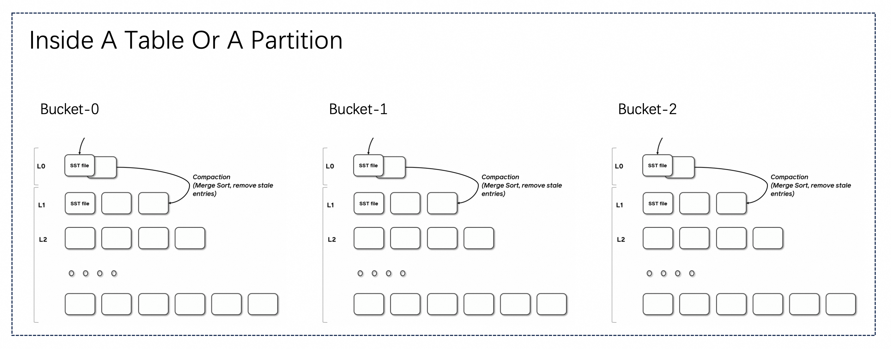
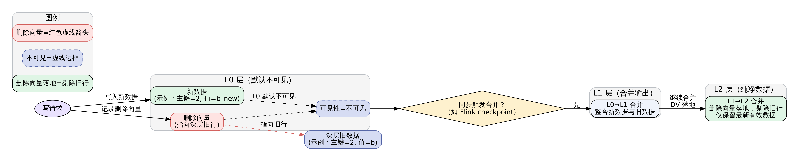

# 参考
[字节跳动 Paimon 实践](https://bytedance.larkoffice.com/docx/KXmVd2QIxo1H34xNymEc442HnZ0)

[Paimon 官方文档](https://paimon.apache.org/docs/0.8/)

# Paimon 数据湖是什么

Apache Paimon 是一项新的流式数据湖存储技术，通过创新性的结合 LSM-Tree 结构和湖格式，可以为用户提供高吞吐、低延迟的数据摄入、完整的流式变更订阅以及高效的 OLAP 查询能力，并同时支持 Flink 和 Spark 计算引擎进行流批加工。

# 核心能力


# 主键表与非主键表

Paimon 表的 主键表（Primary Key Table）和 非主键表（Non-Primary Key Table）是两种核心表类型，其设计目标和适用场景截然不同，核心区别体现在 `数据操作能力、存储架构、适用场景` 等方面。以下是具体对比：

**主键表：**
- 概念：通过 PRIMARY KEY 定义唯一标识记录的字段（或字段组合），支持对已有记录的 更新（UPDATE） 和 删除（DELETE）。即`有更新的需求`，例如订单表（状态变更：待支付→已完成）、用户信息表（修改手机号）等。
- 存储架构：

**非主键表：** 无主键定义，仅支持 插入（INSERT） 操作，不允许更新或删除已有记录（本质是 “仅追加” 模式）。类似传统的 `OLTP` 数据库中的表。例如常见的日志表等。

# 主键表

## 表模式

### 主键表文件结构



要理解 Paimon 主键表的文件结构，我们可以用 **“文件柜 + 分层文件夹”** 的日常类比来拆解，主键表就是一个大文件柜，而其中的`Bucket`就是一个个的小抽屉，数据会按 `主键规则` 分到不同抽屉里（比如按主键哈希值分配，确保同一主键的数据一定在同一个抽屉里）。每个 Bucket 是完全独立的，各自处理自己的数据，避免 “一个抽屉乱了整个文件柜卡住”，能提升并行处理效率。

在每一个 Bucket 中，数据不是杂乱堆放的，而是按 **分层文件树（LSM 树）** 的形式存储，即在每一个抽屉里，又分了很多层的文件夹，每层都放着 `SST 文件`（可以理解为 “打包好的数据文件”，里面存的是有序的主键数据）。

### 分层逻辑
分层的核心目的是 **平衡‘写得快’和‘读得顺’**，就像我们整理文件的逻辑：

1. **L0 层：刚写的 “临时文件”**：当 Flink 处理数据时（比如实时写入、更新），不会直接把数据塞进深层，而是先在 L0 层 “临时存放”—— 每次 Flink 做 “ checkpoint ”（相当于 “保存快照”），就会把内存里的新数据打包成 L0 层的 SST 文件。
2. L1、L2 层：“整理好的归档文件”：随着 L0 层文件越来越多，系统会自动触发 “合并操作（Compaction）”：把 L0 层的文件，或者 L0 与 L1 层的文件，按 “主键” 重新排序、去重（比如同一主键保留最新的那条数据），然后打包成更规整的 SST 文件，放进 L1 层；如果 L1 层文件也多了，再合并到 L2 层。

### 合并模式
根据写入的时候处理方式的不同，有三种处理模式：
1. **MOR（Merge On Read）：** `默认的模式`，在读取的时候才进行 merge。
2. **COW（Copy On Write）：** 建表时使用配置 `'full-compaction.delta-commits' = '1'`，即完全压缩，每次写数据都直接把 L0 合并到最下层（L2），所以读的时候不用整理，但写得慢；
3. **MOW（Merge On Write）：** 建表时使用`'deletion-vectors.enabled' = 'true'`进行配置，通过`删除向量（Deletion Vectors）`和`特定合并策略`来进行合并，其实类似于有些大文件的删除，并不是真的删除了，而是告诉你这块存储区域没东西了，你可以写入到这里了，说白了就是逻辑删除。

### MOW 写入时合并
MOW 写数据的核心是 “先记‘删除标记’，再存新数据”。

**L0 层只存 “新数据 + 删除向量”，不直接改旧文件：** 当有数据更新 / 删除时（比如把主键 = 2 的字段从 “b” 改成 “b_new”），MOW 不会去深层（L1/L2）找旧数据文件修改，而是做两件事：
1. 生成一个 新的 L0 层 SST 文件：里面只存 “主键 = 2，字段 = b_new” 这条新数据（相当于 “新增一页记录，写上新内容”）；
2. 生成一个 删除向量文件（Deletion Vector File）：专门标记 “旧数据在哪里”—— 比如记录 “在 L2 层的某个 SST 文件里，主键 = 2 的那行数据已经失效”（相当于 “贴个小纸条，告诉后续‘别读这行旧的’”）。

通过L0 只放 “刚产生的新数据 + 对应的删除标记”，不做任何深层修改，保证 “写得快”（和 MOR 写 L0 的效率接近），但比 MOR 多了 “提前记删除标记” 的动作。




**L0 层文件默认 “不可见”，必须等合并后才能用：** 和 MOR 不同（MOR 的 L0 文件写完就能被读取，读的时候再合并），MOW 对 L0 层加了 `可见性控制`，刚写好的 L0 层 SST 文件和删除向量文件，**不会直接开放给读请求**，只有等这些 L0 文件被 “合并到深层” 后，新数据才会变成 “可读”—— 这是 MOW 保证数据一致性的关键，避免读的时候拿到 “没整理的临时数据”。

**默认 “同步合并”：L0 写完就触发合并，避免 L0 堆积：** MOW 为了让 L0 层的 “临时数据尽快可用”，默认会在 **写数据后同步触发合并**（比如每次 Flink checkpoint 生成 L0 文件后，立刻启动合并），合并的目标是 “把 L0 层的新数据 + 删除向量，和深层（L1/L2）的旧数据做整合，生成干净的深层文件”。MOW 对 L0 的控制是 `不允许 L0 长期堆积`，通过同步合并快速把 L0 数据 “搬” 到 L1/L2，避免像 MOR 那样 L0 文件过多导致读性能差。

**合并到 L2 等深层：“删除向量落地”，让深层文件更干净：** 当 L1 层的文件越来越多（比如达到配置的大小 / 数量阈值），MOW 会继续触发 “L1→L2 的合并”，逻辑和 L0→L1 类似，但多了一个 “删除向量落地” 的动作。合并时，会直接把 “删除向量标记的旧数据” 从新生成的 L2 文件里 “剔除”，不再保留任何删除标记；最终 L2 层的 SST 文件里，只有 “最新、有效的数据”（同一主键只会出现一次，没有冗余）—— 相当于 “把中层（L1）的文件再整理一遍，归档到下层（L2），并且彻底删掉没用的旧内容”。MOW 对 L2 的控制是 “保证深层文件的纯净度”，后续读 L2 数据时，不需要再处理删除向量（因为已经提前过滤了），所以读性能和 COW 的深层文件一样高效。

**读取数据的各层逻辑：** 虽然 MOW 主要是 “写时控制层级”，但读的时候对层级的处理，也反过来体现了它对层级的控制目标（“读得快”）优先读深层（L2→L1）：因为 L2、L1 层的文件已经过合并，没有冗余数据，也不需要处理删除向量，所以读的时候会先从这些深层文件找数据，效率最高；只有深层没有时，才读 “已合并的 L0”：如果数据刚合并到 L1（还没到 L2），就读 L1；如果有极少量刚合并完的 L0 数据（理论上 MOW 会尽快合并 L0，所以这种情况很少），就读 L0—— 但此时 L0 已经过合并，里面的删除向量已经 “落地”，不会有冗余。


## 合并引擎
当 Paimon 接收器收到两条或多条具有相同主键的记录时，它会将它们合并为一条记录，以保持主键的唯一性。通过指定 merge-engine 表属性，用户可以选择如何合并记录。主要包含的合并引擎有以下几种：
1. 重复删除（deduplicate）
2. 部分列更新（Partial-Update）
3. 聚合（aggregation）
4. 首行数据

<Callout type="info">
实际上，上面的三种方式都是合并的方式，通俗点来说就是看数据是否为`同一个主键`，如果是同一个`同一个主键`则该如何合并的问题，当然每一行都有许多的字段，所以我们也可以自定义每个列该如何的合并。
</Callout>

### 重复删除（deduplicate）

deduplicate 合并引擎是`默认的合并引擎`，Paimon 只会保留最新的记录，并丢弃其他具有相同主键的记录。具体来说，如果最新一条记录是 DELETE 记录，则所有主键相同的记录都会被删除。可以配置 `ignore-delete` 来忽略它。

### 部分列更新
部分列更新是指直接更新表中某些字段值，而不是全部字段值。Paimon 通过Partial Update合并引擎来实现部分列更新。在建表时需指定`'merge-engine' = 'partial-update' `，之后可使用 Update 语句更新部分字段值。例如流 A 更新列 A 和列 B，流 B 更新列 C 和列 D，最终会生成一行包含所有列的数据。


例如，Paimon 先后表收到了下面的三条记录：
```text
<1, 20, 183, NULL>
<1, NULL, NULL, '小明'>
<1, 23, NULL, NULL>
```
第一列是主键，那么最后的结果为`<1, 23, 183, '小明'>`。所以，可以很明显的看出，部分列更新的默认合并方式是：`每个字段最后一个大于原字段的非空值`。可以将其看作版本号，当新的版本号大于原先的版本号的时候，版本中的数据才会发生变更。

### 部分列更新序列组
序列字段主要是用于解决多流更新部分更新表的乱序问题，因为多流更新时，序列字段可能会被另一个流的最新数据覆盖。最终取得的效果是`序列组内的字段是否更新取决于序列字段是否更新`。例如我们参考一下官网的这个案例：

创建 Paimon 表
```sql
CREATE TABLE t
(
    k   INT,
    a   INT,
    b   INT,
    g_1 INT,
    c   INT,
    d   INT,
    g_2 INT,
    PRIMARY KEY (k) NOT ENFORCED
) WITH (
      'merge-engine' = 'partial-update',
      'fields.g_1.sequence-group' = 'a,b',
      'fields.g_2.sequence-group' = 'c,d'
      );
```
配置了两个序列字段，**g_1** 和 **g_2** ，a，b 属于g_1序列组中，而c 和 d 属于 g_2 序列组中。插入初始数据
```sql
INSERT INTO t VALUES (1, 1, 1, 1, 1, 1, 1);
```
现在进行更新数据，即有新的同主键的数据进入
```sql
INSERT INTO t VALUES (1, 2, 2, 2, 2, 2, CAST(NULL AS INT));
```
| k      | a |b |g_1 |c |d |g_2 |
| ----------- | ----------- |----------- |----------- |----------- |----------- |----------- |
| 1     | 1 |1 |1 |1 |1 |1 |
| 1      | 2 |2 |2 |2 |2 |NULL |

我们知道`部分列更新`的字段聚合方式默认是`最后一个数据的这个字段大于原字段的非空值`，所以 **g_1** 被更新了，但是 **g_2** 却没有被更新，所以 a 和 b 如果有更新的话则会产生更新，但是对于 c 和 d，由于序列键没有被更新，所以这两个字段则无法更新。

所以最终的数据则为：1,2,2,2,1,1,1，那么如果我们又插入了下面的数据：
| k      | a |b |g_1 |c |d |g_2 |
| ----------- | ----------- |----------- |----------- |----------- |----------- |----------- |
| 1     | 2 |2 |2 |1 |1 |1 |
| 1      | 3 |3 |1 |3 |3 |3 |

由于 **g_1** 的值小于原先的值，所以可以理解为版本并没有被更新，那么作为 g_1 序列组中的数据 a 和 b 也自然无法更新，所以这个时候 g_2 的数据被更新了。

所以这里需要着重注意的两个要点就是：
1. 部分列更新的字段默认聚合方式为：`最后一个数据的这个字段大于原字段的非空值`
2. 当序列键更新了，序列组中的内容才能更新

### 聚合（aggregation）

<Callout type="warning">
在讲聚合引擎之前，需要着重强调的是聚合有两种概念
1. 聚合引擎，即指定 Paimon 表的`merge-engine`字段内容为`aggregation`，这样的话就是针对相同的主键字段可以使用自定义的聚合函数，也可以使用默认的`last_non_null_value`函数进行聚合。
2. 聚合函数，聚合函数是指针对一些函数，这里一般是同主键的同字段的一组数据要怎么聚合， 所以在 `部分列更新` 中也可以去指定聚合函数。
</Callout>


## 压缩
随着写入 LSM 树的记录越来越多，排序运行的数量也会随之增加。由于查询 LSM 树需要合并所有排序运行，过多的排序运行会导致查询性能下降，甚至内存溢出。为了限制排序运行的数量，我们需要偶尔将多个排序运行合并成一个大的排序运行。这个过程称为压缩。

### 专用压缩
专用压缩是为了解决`多个作业同时写入一张表`的情况下，我们可以选择`跳过写入器中的压缩操作`，并`运行专门的作业来执行压缩操作`。由于压缩操作仅由专用作业执行，因此写入器可以连续写入记录而无需暂停，并且永远不会发生冲突。

所以在使用专用压缩作业之前，我们需要先跳过写入器中的压缩操作，这里有两种方式：
1. 第一种是通过在创建 Paimon 表的时候设置配置信息为`'write-only' = 'true'`。
2. 我们也可以在写入的时候使用 `SQL Hints` 来跳过压缩操作，使用如下代码
```sql
INSERT INTO T /*+OPTIONS('write-only' = 'true') */ SELECT ...;
```
然后我们就可以创建独立的压缩作业来执行压缩操作了。
```sql
-- 参数1: 表名
-- 参数2: 分区, 不指定为全部分区
-- 参数3: 排序策略: order, zorder, hilbert. 仅适用于批任务sort compaction
-- 参数4: 排序字段: 和参数3配合使用, 指定数据需要按什么字段排序, 以逗号分隔
-- 参数5: compaction job 参数

use catalog paimon;
-- 指定compaction全分区, 不指定参数
CALL paimon.sys.compact('paimon_mwj.paimon_test_table', '', '', '', '');
-- 指定compaction全分区, 指定sink并发
CALL paimon.sys.compact('paimon_mwj.paimon_test_table', '', '', '', 'sink.parallelism=6,k1=v2');
```
<Callout type="warning">
但是在使用独立的 Compaction 作业时，需要注意的是
1. 流式Compaction只支持`Flink`作业, 且只支持`1.17`版本
2. 流式Compaction时无需指定分区
3. 流式Compaction初始启动或无状态启动时会从最近一次 Compact 的Snapshot开始, 对后续的Snapshot数据进行增量Compaction
</Callout>
