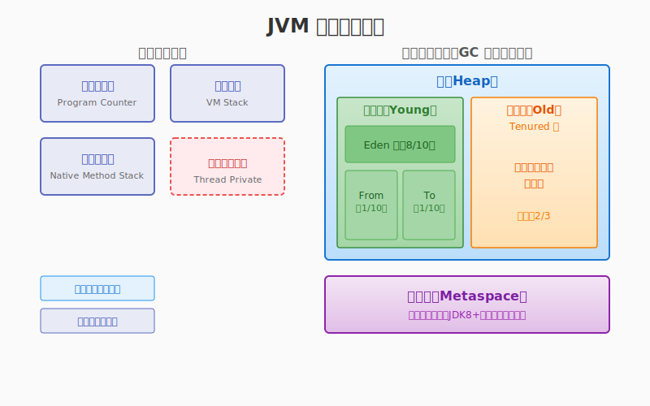
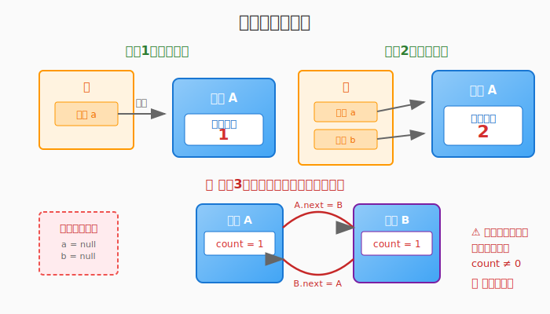
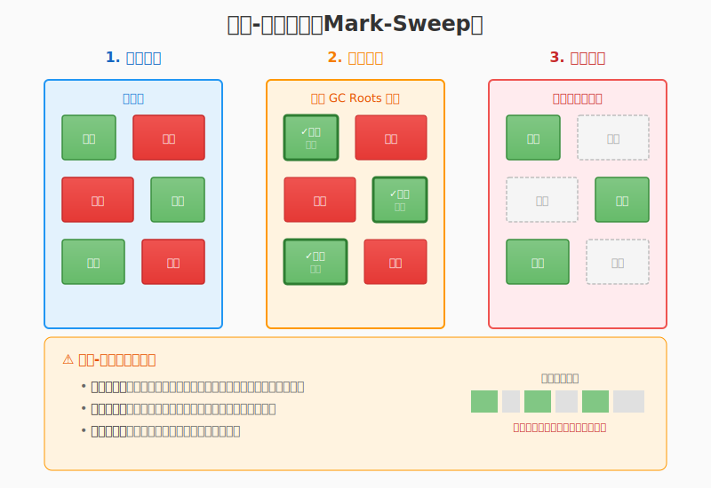
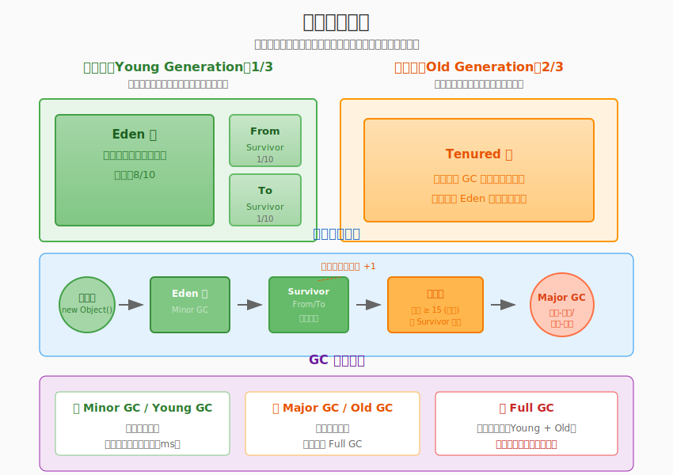

<div className="flex items-center gap-2 mb-6">
  <span className="text-2xl">🗑️</span>
  <span className="text-muted-foreground">本文预计阅读时间：15分钟</span>
</div>

## 什么是垃圾回收（GC）

<Callout type="info">
  **垃圾回收（Garbage Collection，简称 GC）** 是一种自动内存管理机制，它负责自动识别程序中不再使用的内存对象，并将其回收释放，供后续分配使用。
</Callout>

在没有垃圾回收机制的语言（如 C/C++）中，程序员需要手动管理内存：

```c
// C语言示例：手动分配和释放内存
int* ptr = (int*)malloc(sizeof(int) * 100);  // 分配内存
// ... 使用内存 ...
free(ptr);  // 手动释放内存，忘记释放会导致内存泄漏！
```

手动管理内存容易出现以下问题：

| 问题 | 描述 | 后果 |
|------|------|------|
| 🧠 **内存泄漏** | 分配内存后忘记释放 | 可用内存逐渐减少，程序最终崩溃 |
| 💥 **野指针** | 释放内存后继续使用该指针 | 访问非法内存，程序行为不可预测 |
| 🔄 **重复释放** | 同一块内存被释放多次 | 内存损坏，程序崩溃 |

而在 Java、Go、JavaScript 等有 GC 的语言中，程序员只需专注于业务逻辑，内存管理交给 GC 自动处理：

```java
// Java示例：无需手动释放内存
List<String> list = new ArrayList<>();  // 分配内存
list.add("Hello");
// ... 使用完毕，GC会自动回收 ...
list = null;  // 可选：显式断开引用，加速回收
```



## GC 的核心作用

<Sidenote>
  现代 GC 的设计目标不仅是回收垃圾，更是在**吞吐量**、**延迟**和**内存占用**之间寻找最佳平衡。
</Sidenote>

垃圾回收机制主要解决以下三个核心问题：

### 1. 自动内存管理 🎯

GC 自动追踪对象的生命周期，识别不再被程序使用的对象，并回收其占用的内存空间。这让开发者可以：

- ✅ 专注于业务逻辑开发
- ✅ 避免内存泄漏和野指针问题
- ✅ 提高开发效率和代码安全性

### 2. 内存碎片整理 🧩

某些 GC 算法（如标记-整理、复制算法）会在回收过程中整理内存，减少内存碎片，提高内存分配效率。

### 3. 性能优化 ⚡

现代 GC 通过以下方式优化程序性能：

- **分代收集**：利用"大部分对象朝生夕死"的特性，对不同代采用不同策略
- **增量回收**：将长时间暂停的回收过程拆分成多个小步骤
- **并发回收**：与应用程序线程并行执行，减少停顿时间

## 如何判断对象是否是垃圾

GC 工作的第一步是**判断哪些对象还活着，哪些已经成为垃圾**。目前主要有两种判断方法：

### 方法一：引用计数法

**原理**：每个对象维护一个引用计数器，当有一个地方引用它时，计数器 +1；当引用失效时，计数器 -1。当计数器为 0 时，表示对象不再被使用。



```python
# Python早期使用引用计数（配合其他机制）
a = {}      # 对象A的引用计数 = 1
b = a       # 对象A的引用计数 = 2（a和b都引用它）
del a       # 对象A的引用计数 = 1
b = None    # 对象A的引用计数 = 0，可以被回收
```

**优点**：
- ✅ 实现简单，判定效率高
- ✅ 垃圾可以立即被回收

**缺点**：
- ❌ **无法解决循环引用问题**

<Callout type="warning">
  **循环引用问题**：当两个或多个对象相互引用，但没有被外部引用时，它们的引用计数都不为 0，但实际上已经无法被访问到。
</Callout>

```java
// 循环引用示例
class Node {
    Node next;
}

Node a = new Node();  // a: count=1
Node b = new Node();  // b: count=1
a.next = b;           // b: count=2
b.next = a;           // a: count=2

// 即使断开外部引用
a = null;  // a: count=1 (因为b.next还引用着)
b = null;  // b: count=1 (因为a.next还引用着)
// 结果：内存泄漏！两个对象都无法被回收
```

### 方法二：可达性分析法（根搜索算法）

<Callout type="info">
  **可达性分析** 是 Java、C#、Go 等主流语言采用的垃圾判断方法。它通过一系列称为 **GC Roots** 的对象作为起点，向下搜索，搜索走过的路径称为**引用链**。
</Callout>


**GC Roots 包括**：

1. **虚拟机栈中的本地变量表**中引用的对象
2. **方法区中静态属性**引用的对象
3. **方法区中常量**引用的对象
4. **本地方法栈中 JNI（Native 方法）**引用的对象
5. **所有被同步锁（synchronized 关键字）持有的对象**
6. **Java 虚拟机内部的引用**（如基本数据类型对应的 Class 对象、常驻异常对象等）

```java
public class GCRootsExample {
    // 1. 静态变量是 GC Root
    private static Object staticObj = new Object();
    
    // 2. 常量也是 GC Root
    private static final String CONSTANT = "I am GC Root";
    
    public void method() {
        // 3. 栈中的本地变量是 GC Root
        Object localObj = new Object();
        
        // localObj 是 GC Root，它引用的对象都是可达的
        Node node = new Node();
        node.data = localObj;
    }  // 方法结束，localObj 出栈，不再作为 GC Root，node 可能被回收
}
```

**优点**：
- ✅ 可以解决循环引用问题
- ✅ 准确性高，是目前主流 JVM 的选择

**缺点**：
- ❌ 需要 STW（Stop The World）来保证分析期间引用关系不变化
- ❌ 实现相对复杂

## 垃圾回收算法详解

确定了哪些对象是垃圾后，GC 需要**执行回收**，释放内存。不同的回收算法有不同的实现原理和适用场景。

<Tabs defaultValue="mark-sweep" className="w-full">
  <TabsList className="grid w-full grid-cols-4">
    <TabsTrigger value="mark-sweep">标记-清除</TabsTrigger>
    <TabsTrigger value="copy">复制算法</TabsTrigger>
    <TabsTrigger value="mark-compact">标记-整理</TabsTrigger>
    <TabsTrigger value="generational">分代收集</TabsTrigger>
  </TabsList>
  
  <TabsContent value="mark-sweep" className="space-y-4">
    ### 标记-清除算法（Mark-Sweep）
    
    这是最基础的垃圾回收算法，分为两个阶段：
    
    1. **标记阶段**：从 GC Roots 开始遍历，标记所有可达对象
    2. **清除阶段**：遍历整个堆，清除未被标记的对象
    
    
    
    ```java
    // 伪代码示意
    void markSweep() {
        // 阶段1：标记
        for (root : gcRoots) {
            mark(root);  // 递归标记所有可达对象
        }
        
        // 阶段2：清除
        for (obj : heap) {
            if (!obj.isMarked) {
                free(obj);  // 回收未标记的对象
            } else {
                obj.isMarked = false;  // 重置标记，为下次GC做准备
            }
        }
    }
    ```
    
    **优点**：
    - ✅ 实现简单，不需要额外空间
    
    **缺点**：
    - ❌ **产生内存碎片**：清除后会产生大量不连续的内存碎片
    - ❌ **效率较低**：标记和清除都需要遍历整个堆
    - ❌ **分配大对象困难**：碎片导致大对象可能无法找到连续内存空间
  </TabsContent>
  
  <TabsContent value="copy" className="space-y-4">
    ### 复制算法（Copying）
    
    将内存分为大小相等的两块，每次只使用其中一块。当一块内存用完时，将存活的对象复制到另一块，然后清理整个已使用的内存空间。
    
    
    
    ```java
    // 伪代码示意
    void copyingGC() {
        // from: 当前使用的内存块
        // to: 空闲的内存块
        
        for (obj : fromSpace) {
            if (obj.isAlive) {
                copy(obj, toSpace);  // 复制存活对象到to空间
            }
        }
        
        clear(fromSpace);  // 清空from空间
        swap(fromSpace, toSpace);  // 交换两个空间的角色
    }
    ```
    
    **优点**：
    - ✅ **无内存碎片**：存活对象被紧凑排列
    - ✅ **分配速度快**：只需移动指针即可分配
    - ✅ **回收效率高**：只需复制存活对象，清除整个半区
    
    **缺点**：
    - ❌ **内存利用率低**：只有一半的内存可用
    - ❌ **复制开销大**：存活对象多时，复制成本高
    
    **适用场景**：适合存活对象较少的场景（如新生代）
  </TabsContent>
  
  <TabsContent value="mark-compact" className="space-y-4">
    ### 标记-整理算法（Mark-Compact）
    
    结合了标记-清除和复制算法的优点。标记阶段与标记-清除相同，但清除阶段不是直接清理，而是将存活对象向一端移动，然后清理边界外的内存。
    
    
    
    ```java
    // 伪代码示意
    void markCompact() {
        // 阶段1：标记
        for (root : gcRoots) {
            mark(root);
        }
        
        // 阶段2：整理（压缩）
        compactAddress = heap.start;
        for (obj : heap) {
            if (obj.isMarked) {
                move(obj, compactAddress);  // 移动对象
                compactAddress += obj.size;
            }
        }
        
        // 阶段3：清理尾部
        freeRange(compactAddress, heap.end);
    }
    ```
    
    **优点**：
    - ✅ **无内存碎片**：对象被紧凑排列
    - ✅ **内存利用率高**：不需要额外空间
    
    **缺点**：
    - ❌ **移动对象开销大**：需要更新所有引用地址
    - ❌ **STW 时间长**：整理过程需要暂停应用
    
    **适用场景**：适合存活对象较多的场景（如老年代）
  </TabsContent>
  
  <TabsContent value="generational" className="space-y-4">
    ### 分代收集算法（Generational Collection）
    
    基于**弱分代假说**：绝大多数对象都是朝生夕灭的（新生代），熬过多次 GC 的对象很难消亡（老年代）。
    
    
    
    **堆内存划分**：
    
    | 区域 | 占比 | 特点 | 适用算法 |
    |------|------|------|----------|
    | **新生代** | 1/3 | 对象生命周期短，存活率低 | 复制算法 |
    | **老年代** | 2/3 | 对象生命周期长，存活率高 | 标记-清除或标记-整理 |
    
    **对象晋升过程**：
    
    ```
    新对象 → Eden区 → Survivor区（From/To）→ 老年代
              ↓         ↓              ↓
            大对象    Minor GC      达到晋升年龄
           直接进    复制存活对象    (默认15岁)
           老年代    到Survivor
    ```
    
    **Minor GC vs Major GC vs Full GC**：
    
    <Accordion type="single" collapsible className="w-full">
      <AccordionItem value="minor">
        <AccordionTrigger>🌱 Minor GC（Young GC）</AccordionTrigger>
        <AccordionContent>
          只回收新生代。因为新生代对象存活率低，使用复制算法效率高。发生频率高，但停顿时间短（通常在几十毫秒内）。
        </AccordionContent>
      </AccordionItem>
      <AccordionItem value="major">
        <AccordionTrigger>🌳 Major GC（Old GC）</AccordionTrigger>
        <AccordionContent>
          只回收老年代。通常与 Full GC 等价，因为回收老年代时往往也需要回收其他区域。使用标记-清除或标记-整理算法。
        </AccordionContent>
      </AccordionItem>
      <AccordionItem value="full">
        <AccordionTrigger>🌍 Full GC</AccordionTrigger>
        <AccordionContent>
          回收整个堆（新生代 + 老年代 + 方法区）。触发条件：老年代空间不足、方法区空间不足、System.gc() 调用等。停顿时间长，应尽量避免。
        </AccordionContent>
      </AccordionItem>
    </Accordion>
  </TabsContent>
</Tabs>

## 新一代垃圾收集器

随着 Java 应用规模的扩大和对低延迟要求的提高，传统的垃圾收集器（如 Serial、Parallel、CMS）逐渐无法满足需求。新一代垃圾收集器 **G1** 和 **ZGC** 应运而生。

### G1 垃圾收集器（Garbage First）

<Callout type="info">
  **G1（Garbage First）** 是 JDK 9 之后的默认垃圾收集器，目标是替代 CMS，兼顾吞吐量和低延迟。
</Callout>


**核心设计：Region 化内存管理**

G1 将堆划分为多个大小相等的 **Region**（默认 2048 个），每个 Region 可以扮演不同的角色：

```
┌─────────────────────────────────────────────────────────┐
│  Eden  │  Eden  │Survivor│  Old   │  Old   │ Humongous │
│ Region │ Region │ Region │ Region │ Region │  Region   │
├─────────────────────────────────────────────────────────┤
│  Eden  │  Old   │  Old   │Survivor│  Eden  │    ...    │
│ Region │ Region │ Region │ Region │ Region │           │
└─────────────────────────────────────────────────────────┘
         ↑ 物理上不连续，逻辑上属于不同代
```

- **Eden Region**：新生代 Eden 区
- **Survivor Region**：新生代 Survivor 区  
- **Old Region**：老年代
- **Humongous Region**：存放大对象（大于 Region 50%）

**G1 的回收过程**：

<Accordion type="single" collapsible>
  <AccordionItem value="young">
    <AccordionTrigger>🌱 Young GC（新生代回收）</AccordionTrigger>
    <AccordionContent>
      回收所有 Eden Region 和 Survivor Region，将存活对象复制到新的 Survivor Region 或晋升到 Old Region。采用**并行复制算法**，STW 时间与 Region 数量相关，而非整个堆大小。
    </AccordionContent>
  </AccordionItem>
  <AccordionItem value="concurrent">
    <AccordionTrigger>🔄 Concurrent Marking Cycle（并发标记周期）</AccordionTrigger>
    <AccordionContent>
      1. **Initial Mark（初始标记）**：STW，标记 GC Roots 直接关联的对象
      2. **Root Region Scanning**：扫描 Survivor 区引用老年代的对象
      3. **Concurrent Mark（并发标记）**：与应用线程并发执行，标记存活对象
      4. **Remark（重新标记）**：STW，处理并发期间变动的引用
      5. **Cleanup（清理）**：统计存活对象，回收完全空闲的 Region
    </AccordionContent>
  </AccordionItem>
  <AccordionItem value="mixed">
    <AccordionTrigger>🎯 Mixed GC（混合回收）</AccordionTrigger>
    <AccordionContent>
      不仅回收新生代，还回收部分老年代 Region。根据**暂停时间目标**（-XX:MaxGCPauseMillis，默认 200ms），选择回收价值最高（垃圾最多）的老年代 Region，**Garbage First** 由此得名。
    </AccordionContent>
  </AccordionItem>
</Accordion>

**G1 的优势**：

| 特性 | 说明 |
|------|------|
| 📊 **可预测的停顿时间** | 用户可以设定目标停顿时间，G1 会尽量满足 |
| 🎯 **区域化收集** | 优先回收垃圾最多的 Region，提高回收效率 |
| 🧹 **空间整合** | 整体采用标记-整理，局部采用复制，无内存碎片 |
| 🔄 **并发标记** | 大部分标记工作与应用程序并发执行 |

```bash
# 启用 G1 收集器（JDK 9+ 默认已启用）
java -XX:+UseG1GC -XX:MaxGCPauseMillis=200 MyApplication
```

### ZGC 垃圾收集器（The Scalable Low-Latency GC）

<Callout type="info">
  **ZGC** 是 JDK 11 引入的实验性低延迟垃圾收集器，JDK 15 正式可用。目标是：**无论堆多大，停顿时间都不超过 10ms**。
</Callout>


**ZGC 的核心特性**：

#### 1. 并发处理能力

ZGC 几乎所有工作都是并发执行的：

```
┌─────────────┬─────────────┬─────────────┬─────────────┐
│  标记开始   │   并发标记   │   并发预备   │  标记结束   │
│  (STW <1ms) │  (与应用并发)│  (与应用并发)│  (STW <1ms) │
├─────────────┼─────────────┼─────────────┼─────────────┤
│  重定位开始 │   并发重定位 │   并发转移   │  重定位结束 │
│  (STW <1ms) │  (与应用并发)│  (与应用并发)│  (STW <1ms) │
└─────────────┴─────────────┴─────────────┴─────────────┘
       ↑ 停顿时间极短，且与堆大小无关！
```

#### 2. 基于 Region 的动态内存管理

ZGC 的 Region 大小不固定，分为：

- **Small Region**：2MB，存放小于 256KB 的对象
- **Medium Region**：32MB，存放 256KB ~ 4MB 的对象
- **Large Region**：N × 2MB，存放大于 4MB 的对象

#### 3. 染色指针（Colored Pointers）

<Callout type="warning">
  **染色指针** 是 ZGC 的核心技术创新。它将对象的元信息（标记状态、重定位状态）直接编码在指针中，而非对象头。
</Callout>


```
64位指针布局（ZGC只使用低44位作为地址，高位存储元数据）：

┌────┬────┬────┬────────────────────────────────────────────┐
│Remapped│Marked1│Marked0│        对象地址（44位）              │
│  (1)   │  (1)  │  (1)  │    （支持最大 16TB 堆内存）          │
├────────┴───────┴───────┴────────────────────────────────────┤
│ 18位预留 │  染色位  │              44位地址                  │
└─────────────────────────────────────────────────────────────┘
```

**染色指针的优势**：
- ✅ **无需访问对象头**：直接通过指针判断对象状态，加速标记和重定位
- ✅ **多视图映射**：利用虚拟内存映射，实现对象移动对应用透明

#### 4. 读屏障（Load Barrier）

ZGC 使用读屏障来处理并发重定位：

```java
// 伪代码：读屏障的作用
Object readField(ObjectField field) {
    Object ref = field.value;  // 读取引用
    
    // 检查指针是否指向重定位集
    if (isForwardingRef(ref)) {
        return getForwardedObject(ref);  // 返回新地址的对象
    }
    return ref;
}
```

读屏障确保应用总是访问到正确的对象，即使对象正在被移动。

**ZGC 适用场景**：

- 超大堆内存（TB 级别）
- 对延迟极度敏感的应用（金融交易、游戏服务器）
- 需要 consistent 低延迟的流处理系统

```bash
# 启用 ZGC（JDK 15+）
java -XX:+UseZGC -Xmx16g MyApplication

# JDK 17+ 可配合分代 ZGC（实验性）
java -XX:+UseZGC -XX:+ZGenerational MyApplication
```

## GC 对比总结

| 收集器 | 目标 | 算法 | 停顿时间 | 适用场景 |
|--------|------|------|----------|----------|
| **Serial** | 单线程 | 复制/标记-整理 | ~100ms | 客户端/嵌入式 |
| **Parallel** | 吞吐量优先 | 复制/标记-整理 | ~100ms | 后台计算 |
| **CMS** | 低延迟 | 标记-清除 | ~10-100ms | 互联网应用 |
| **G1** | 平衡 | 标记-整理 + 复制 | ~10-200ms | 大堆通用 |
| **ZGC** | 超低延迟 | 染色指针 + 读屏障 | 10ms | 超大堆/金融 |
| **Shenandoah** | 超低延迟 | Brooks指针 | 10ms | OpenJDK 版本 |

<Callout type="warning">
  **选择建议**：
  - JDK 8：默认 Parallel，可选 CMS（低延迟）或 G1（大堆）
  - JDK 9~17：默认 G1，大堆低延迟场景选 ZGC
  - JDK 17+：中小堆用 G1，超大堆（>16GB）用 ZGC
</Callout>

## 结语

垃圾回收是 JVM 的核心机制，理解 GC 原理对于：

1. **排查内存问题**：OOM、内存泄漏、GC 频繁等
2. **性能调优**：根据应用特点选择合适的收集器和参数
3. **架构设计**：合理规划对象生命周期，减少 GC 压力

随着硬件发展和应用需求变化，GC 技术也在不断演进：

- **G1** 在吞吐量和延迟之间找到良好平衡
- **ZGC** 和 **Shenandoah** 正在将停顿时间推向极限
- **分代 ZGC** 在 JDK 21+ 中成为默认，兼顾年轻代和老年代的优化

掌握这些知识，你将能够更好地驾驭 JVM，打造高性能的 Java 应用！

---

<div className="mt-8 p-4 bg-muted rounded-lg">
  <h4 className="font-semibold mb-2">📚 延伸阅读</h4>
  <ul className="list-disc list-inside space-y-1 text-sm">
    <li>《深入理解 Java 虚拟机》- 周志明</li>
    <li>《Java Performance》- Scott Oaks</li>
    <li>OpenJDK 官方文档：<a href="https://openjdk.org/projects/zgc/" className="text-blue-600 hover:underline">ZGC Project</a></li>
  </ul>
</div>
