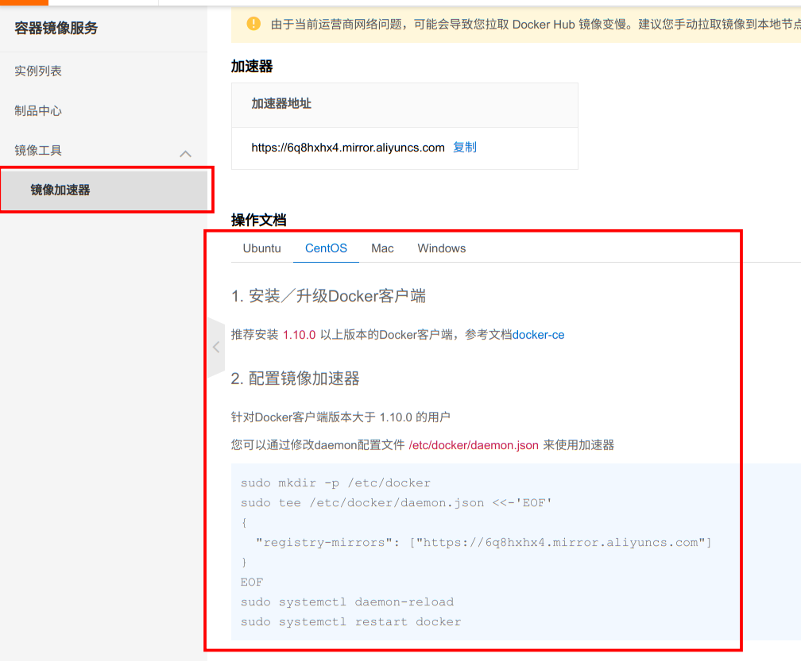

# Docker 安装
Docker 核心使用的是 Linux 的 `cgroup` 和 `namespace` 等技术，所以需要在 Linux 系统上安装 Docker，而在 Windows 与 Mac 系统上都是虚拟了一个 Linux 的子系统来运行 Docker。

- 官方 Docker 安装文档-->[Docker 安装](https://docs.docker.com/get-docker/)
- getdocker 文档-->[getdocker](https://get.docker.com/)

**安装方式：**
```shell
curl -fsSL https://get.docker.com -o install-docker.sh
sudo sh install-docker.sh
```
安装完成之后，执行 `docker version` 命令，如果出现版本信息，则说明安装成功。


# Docker 镜像加速
Docker在国内使用非常的慢，那我们可以使用阿里云的Docker镜像加速器。使用阿里云的容器镜像服务功能-->[容器镜像服务](https://cr.console.aliyun.com/)


得到阿里云的镜像加速地址之后，执行如下的命令即可：

```shell {4}
sudo mkdir -p /etc/docker
sudo tee /etc/docker/daemon.json <<-'EOF'
{
  "registry-mirrors": ["你的镜像加速地址"]
}
EOF
sudo systemctl daemon-reload
sudo systemctl restart docker
```

之前有段时间，Docker 镜像被大规模的封禁，导致无法正常使用，所以我们可以通过 `docker_image_pusher` 这个 github 项目去配置 `github action` 自动推送镜像到阿里云的容器镜像服务，然后再使用自己的
阿里云镜像即可快速的拉取镜像。地址为-->[docker_image_pusher](https://github.com/ssrskl/docker_image_pusher)，具体的使用方法在项目中的 `README` 文件中有详细的介绍，这里就不再赘述了。


