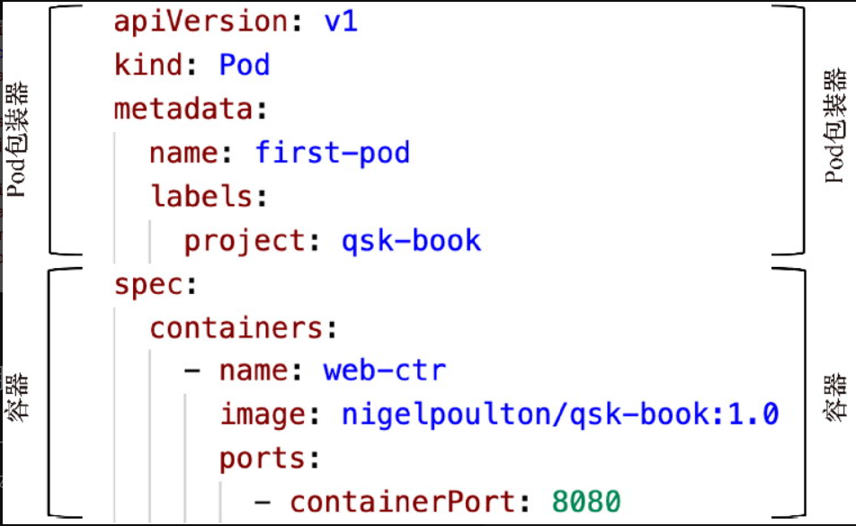
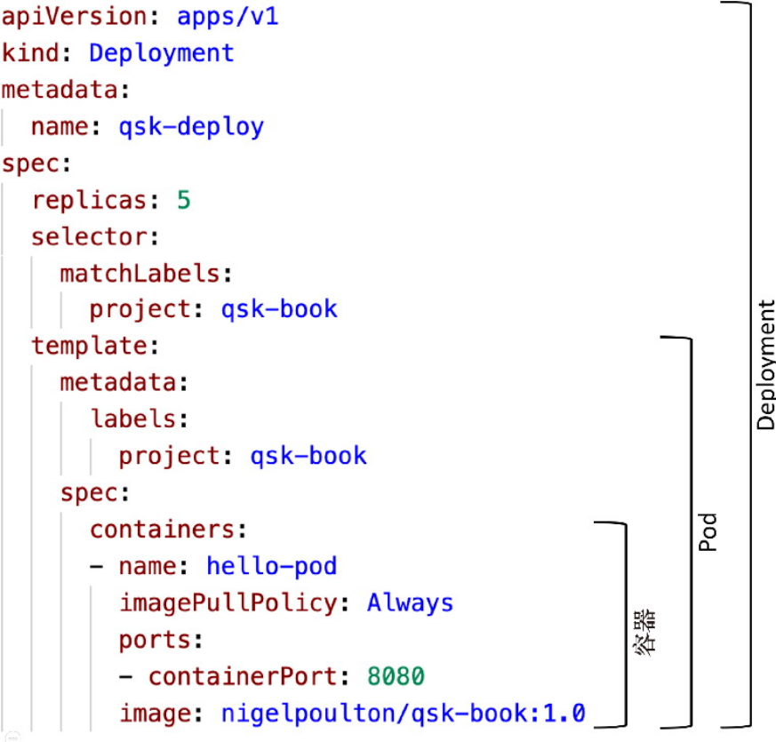

# Kubernetes

# Kubernetes 部署
## 构建 Pod
尽管Kubernetes可以编排和运行容器，但这些容器不得不被包装在一个叫Pod的Kubernetes结构中。就把Pod想象成一个围绕容器的轻量级包装器。事实上，我们有时会互换使用容器和Pod这两个术语。现在，你只需要知道Kubernetes在Pod中运行容器。

要部署的Pod是在一个叫pod.yml的YAML文件中定义的

```yaml
apiVersion: v1
kind: Pod 
metadata:
  name: first-pod
  labels:
    project: qsk-book 
spec:
  containers:
  - name: web 
    image: nigelpoulton/qsk-book:1.0 
    ports:
- containerPort: 8080
```



查询运行的Pod

```bash
kubectl get pods
```

部署Pod

```bash
$ kubectl apply -f pod.yml
pod/first-pod created
　
$ kubectl get pods 
NAME          READY       STATUS    RESTARTS      AGE
first-pod     1/1         Running       0         10s
```

kubectl提供了get和describe两个命令来查询对象的配置和状态

```bash
kubectl describe pod first-pod
kubectl get pod first-pod
```
<Callout type="info">
    **提示：** 
    尽管Pod已经启动，应用正在运行，但你还需要另一个Kubernetes对象才能在网络上连接到该应用
</Callout>

## 连接到Pod

连接到Pod中的应用需要一个独立的对象，称为Service（服务）。Service对象的唯一用途是提供到与Pod中运行的应用的稳定网络连通性。

svc-cloud.yml文件定义了一个Service对象，以便在你的集群在云中时提供连接

```yaml
apiVersion: v1
kind: Service
metadata:
  name: cloud-lb
spec:
  type: LoadBalancer
  ports:
  - port: 80
    targetPort: 8080
  selector:
project: qsk-book
```

spec.type:LoadBalancer字段告诉Kubernetes在底层云平台上配置一个面向互联网的负载均衡器。该负载均衡器将在80端口接收流量，并转发到任何带有project: qsk-book标记的Pod的8080端口。

## 部署Service

同样的也是通过`apply`来部署Service

```bash
$ kubectl apply -f svc-local.yml
service/svc-local created
```

使用下面的命令来验证该Service已经启动和运行

```bash
$ kubectl get svc
NAME      TYPE     CLUSTER-IP    EXTERNAL-IP PORT(S)       AGE
svc-local NodePort 10.108.72.184 <none>      80:31111/TCP  11s
```

- CLUSTER-IP值是内部Kubernetes Pod网络上的一个IP地址，被集群上运行的其他Pod和应用使用。

## 清理kubernetes

清理Service

```shell
$ kubectl delete svc cloud-lb
service "cloud-lb" deleted
```

清理Pod

```shell
$ kubectl delete pod first-pod 
pod "first-pod" deleted
```

# 自我修复

[https://kubernetes.io/zh-cn/docs/concepts/workloads/controllers/deployment/](https://kubernetes.io/zh-cn/docs/concepts/workloads/controllers/deployment/)

有另一个称为Deployment的专用对象，用于提供自我修复(self-healing)。事实上，Deployment也可以实现扩缩容和滚动更新。Deployment 用于管理运行一个应用负载的一组 Pod，通常适用于不保持状态的负载。



1. 容器提供操作系统和其他应用依赖。
2. Pod提供元数据和其他结构，以便容器在Kubernetes上运行。
3. Deployment提供云原生功能，包括自我修复。

有两个元素对Deployment的工作很重要：

1. Deployment对象：是定义Pod和容器的YAML配置。它还定义了要部署多少个Pod副本等事项。
2. Deployment控制器：是一个运行在控制面板上的进程，它始终在监控集群，确保所有的Deployment对象都按规定运行。

假设你在Kubernetes的Deployment清单中定义了一个应用。它定义了名为zephyr-one的Pod的5个副本。你使用kubectl将其发送给Kubernetes，Kubernetes将5个Pod调度到集群上。在这一点上，观察到的状态(observed state)与期望状态(desired state)一致。这是专业的说法，说的是集群正在运行你要求它运行的内容。但是，假设一个节点发生故障了，名为zephyr-one的Pod数量下降到4个。观察到的状态不再与期望状态相匹配，此时就出现了问题。但不要紧张，Deployment控制器监视着集群，并将看到这一变化。它知道你想要5个Pod，但它只能观察到4个。因此，它将启动第5个Pod，使观察到的状态重新与期望状态保持一致，这个过程对应的技术术语是和解(reconciliation)，但我们经常称其为自我修复。

```yaml
kind: Deployment         <<== 被定义的对象的类型
apiVersion: apps/v1      <<== 要部署的对象的版本
metadata:
  name: qsk-deploy            
spec:
  replicas: 5            <<== 要部署多少个Pod副本
  selector:
    matchLabels:         <<== 告诉Deployment控制器
      project: qsk-book  <<== 管理哪些Pod
  template:
    metadata:
      labels:
        project: qsk-book <<== Pod标签
    spec:   
      containers:
      - name: qsk-pod
        imagePullPolicy: Always  <<== 永远不使用本地镜像
        ports:
        - containerPort: 8080             <<== 网络端口
image: nigelpoulton/qsk-book:1.0  <<== 要使用的镜像
```

查询Deployments

```shell
kubectl get deployments
```

部署Deployments

```shell
$ kubectl apply -f deploy.yml
deployment.apps/qsk-deploy created
```

Pod和它们运行的应用有可能崩溃或发生故障。Kubernetes可以通过启动一个新的Pod来替代失败的Pod，从而尝试自我修复这样的情况。

# 应用扩缩容

## 应用扩容

扩缩容的单位是Pod，因此扩容将增加Pod副本，而缩容将删除Pod副本。

手动编辑Deployment YAML文件，将副本的数量增加到10个，并重新将其发送给Kubernetes

检查当前的副本数量

```shell
$ kubectl get deployment qsk-deploy
NAME          READY   UP-TO-DATE   AVAILABLE   AGE
qsk-deploy    5/5     5            5           16h
```

编辑deploy.yml文件，将spec.replicas字段设置为10，并保存修改：

```yaml
apiVersion: apps/v1
kind: Deployment 
metadata:
  name: qsk-deploy 
spec:
  replicas: 5           <<== 将这里改成10
  selector: 
    matchLabels: 
      project: qsk-book 
<Snip>
```

使用kubectl将更新的文件重新发送给Kubernetes。当Kubernetes收到该文件时，它将把期望状态从5个副本改为10个。Deployment控制器将观察集群上的5个副本，并注意到它不符合新的期望状态。它将调度5个新副本，使观察到的状态与期望状态一致。

## 应用缩容

应用缩容在本节中，你将使用kubectl scale命令将Pod的数量缩减回5个。这种方法被称为命令式方法，不像声明式方法那样常见

```shell
$ kubectl scale --replicas 5 deployment/qsk-deploy
deployment.apps/qsk-deploy scaled
```

> **注意：用kubectl scale命令式地完成扩缩容操作会很危险。**

# 滚动更新

即使Kubernetes以有条不紊的方式每次更新1个副本，直到5个副本都运行新版本。

更新deploy.yml文件

```yaml
1 apiVersion: apps/v1
2 kind: Deployment 
3 metadata:
4   name: qsk-deploy 
5 spec:
6   replicas: 5 
7   selector:
8     matchLabels:
9       project: qsk-book 
10  minReadySeconds: 20            <<== 添加这一行
11  strategy:                      <<== 添加这一行
12    type: RollingUpdate          <<== 添加这一行
13    rollingUpdate:               <<== 添加这一行
14      maxSurge: 1                <<== 添加这一行
15      maxUnavailable: 0          <<== 添加这一行
16  template:
17    metadata:
18      labels:
19        project: qsk-book 
20    spec:
21      containers:
22      - name: hello-pod 
23        imagePullPolicy: Always 
24        ports:
25        - containerPort: 8080 
26        image: nigelpoulton/qsk-book:1.1 <<== 设置为1.1
```

- minReadySeconds: 20：告诉Kubernetes在更新每个副本后要等待20秒。

<Callout type="info">
    **提示：** 
    Kubernetes实际上没有更新副本，它所做的是删除现有的副本，并用一个运行新版本的全新副本来代替它们
</Callout>

- 更新类型为RollingUpdate：以滚动更新的方式执行对此Deployment的所有更新
- 第14行和第15行强制Kubernetes一次更新一个Pod，运行机制是：第14行中maxSurge=1允许Kubernetes在更新操作中增加一个额外的Pod，期望状态需要5个Pod，所以Kubernetes可以在更新期间将其增加到6个；第15行中maxUnavailable=0防止Kubernetes在更新期间减少Pod的数量，期望状态还是需要5个Pod，所以Kubernetes不允许比这更少。结合起来，第14行和第15行迫使Kubernetes删除运行旧版本的副本的同时增加运行新版本的第六个副本。这个过程一直重复，直到5个副本全都在运行需要的版本。

当更新完毕deploy.yml后可以使用apply命令进行部署，然后使用如下命令进行监听

```shell
$ kubectl rollout status deployment qsk-deploy
Waiting for rollout to finish: 1 out of 5 have been updated...
Waiting for rollout to finish: 1 out of 5 have been updated...
Waiting for rollout to finish: 2 out of 5 have been updated...
Waiting for rollout to finish: 2 out of 5 have been updated...
Waiting for rollout to finish: 3 out of 5 have been updated...
Waiting for rollout to finish: 3 out of 5 have been updated...
Waiting for rollout to finish: 4 out of 5 have been updated...
Waiting for rollout to finish: 4 out of 5 have been updated...
Waiting for rollout to finish: 2 old replicas are pending termination...
Waiting for rollout to finish: 1 old replicas are pending termination...
deployment "qsk-deploy" successfully rolled out
```