# 理解大模型
## 构建大语言模型
# 处理文本数据
## 理解词嵌入
包括大语言模型在内的深度神经网络模型无法直接处理原始文本。由于文本数据是离散的，因此我们无法直接用它来执行神经网络训练所需的数学运算。我们需要一种将单词表示为连续值的向量格式的方法。

**词嵌入：** ***将数据转换为向量格式的过程通常称为嵌入(embedding)***。嵌入的本质是将离散对象（如单词、图像甚至整个文档）映射到连续向量空间中的点，其主要目的是将非数值的数据转换为神经网络可以处理的格式。

**特点：** 不同的数据格式需要使用不同的嵌入模型。

**分类：** 人们已经开发出多种算法和框架来生成词嵌入

1. word2vec：word2vec的核心思想是，出现在相似上下文中的词往往具有相似的含义。因此，当这些词嵌入被投影到二维空间并进行可视化时，我们可以看到意义相似的词聚集在一起。
## 文本分词

**词元（token）** ：既可以是单个单词，也可以是包括标点符号在内的特殊字符

语言模型中文本处理步骤概览。在这一步骤图中，我们将输入文本分割成了单独的词元，这些词元既可以是单词，也可以是诸如标点符号之类的特殊字符

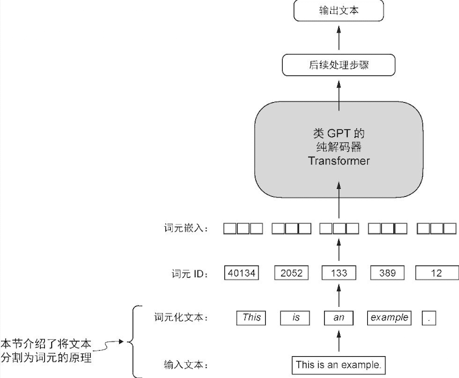

## 词元化文本
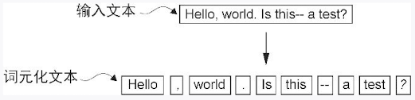

### 将词元转换为词元 ID

为了将先前生成的词元映射到词元 ID，首先需要构建一张词汇表。这张词汇表定义了如何将每个唯一的单词和特殊字符映射到一个唯一的整数

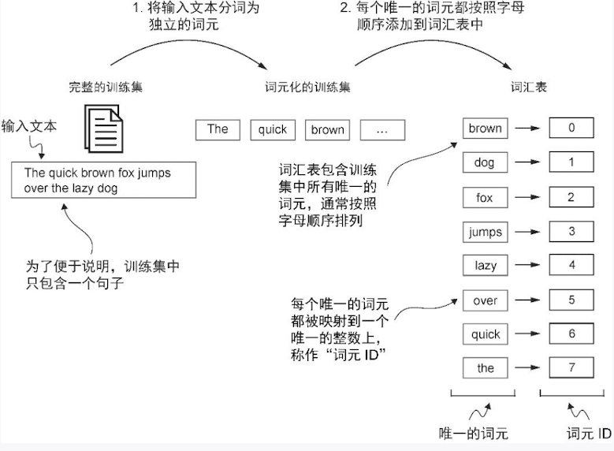


1. 将词元排序
2. 按照顺序给编号
3. 自定义一个分词器

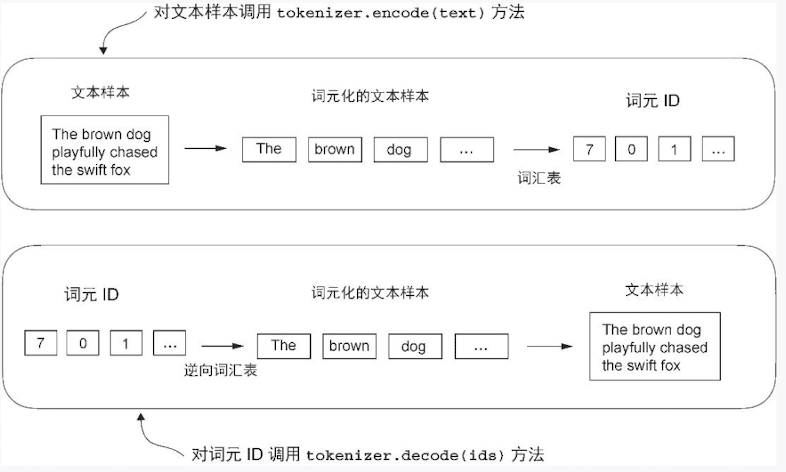
<Callout type="info">
    **提示：** 
例如这段代码

```python
text = "Hello, do you like tea?"
print(tokenizer.encode(text)
```

将会报错`KeyError: 'Hello`

问题在于，“Hello”这一单词并未在短篇小说 The Verdict中出现，因此没有被收录到词汇表中。这一现象凸显了在处理大语言模型时，使用规模更大且更多样化的训练集来扩展词汇表的必要性。
</Callout>

### 引入特殊上下文词元---BPE 算法
**字节对编码** (Byte Pair Encoding)，一句话概括：**它是一种能让电脑“创造”新词的方法，聪明地处理各种文字。**

想象一下，你要教一个只认识26个英文字母的机器人读懂所有英文文章。它会遇到很多不认识的单词，比如 "reading"。

BPE 算法就是为了解决这个问题而生的。它最初是一种数据压缩技术，后来在自然语言处理（NLP）领域大放异彩，尤其是被现在我们熟知的 **GPT** 等大型语言模型（LLM）所采用。

BPE 的核心思想非常简单，可以比作“合并同类项”：**在整个文本中，找出最常连续出现的字符组合，然后把它们合并成一个新的、更长的“词块”(subword)，并把它加入到词典里。**  不断重复这个过程，直到词典大小达到我们的要求。

这样一来，电脑的词典里不仅有单个的字母（`r`, `e`, `a`, `d`, `i`, `n`, `g`），还会有一些高频出现的组合，比如 `re`、`ad`、`ing`，甚至 `read`。


假设我们的语料库里只有几个词，并且我们想学习一套 BPE 规则：`low` (5次), `lowest` (2次), `newer` (6次), `wider` (3次)

**准备工作**

首先，我们把每个单词拆成最基本的字符，并在结尾加上一个特殊符号 `</w>` 来表示单词的结束。同时，统计每个单词出现的频率。

- `l o w </w>` (5次)
- `l o w e s t </w>` (2次)
- `n e w e r </w>` (6次)
- `w i d e r </w>` (3次)

我们最初的“词典”里只有这些基本字符：`{l, o, w, e, s, t, n, r, i, d}`。

**找出最常见“邻居”并合并**

现在，我们来数一数所有相邻字符对（pair）出现的次数。

- `(e, r)`: 在 `newer` 中出现6次，在 `wider` 中出现3次，总共9次。
- `(l, o)`: 在 `low` 和 `lowest` 中出现 5+2\=7次。
- ... 其他组合 ...

我们发现 `(e, r)` 是出现最频繁的组合。

于是，我们进行第一次合并：把所有的 `e` 和 `r` 合并成一个新的词块 `er`。

**再次寻找并合并**

现在我们的语料库变成了：

- `l o w </w>` (5次)
- `l o w e s t </w>` (2次)
- `n e w er </w>` (6次)
- `w i d er </w>` (3次)

词典里也加入了新成员：`{..., er}`。

我们再次重复上一步，寻找最常见的相邻组合。这次我们发现 `(er, </w>)` 出现了 6+3\=9次（来自 `newer` 和 `wider`）。

于是，我们进行第二次合并：把 `er` 和 `</w>` 合并成 `er</w>`。

**不断重复**

这个“寻找最频繁组合 -\> 合并 -\> 加入词典”的过程会一直重复下去。

- 下一次可能是合并 `l` 和 `o` 变成 `lo`。
- 再下一次可能是合并 `lo` 和 `w` 变成 `low`。

这个过程会进行预设好的次数，或者直到词典达到预设的大小（例如，5万个词块）。

# 编码注意力机制
- 注意力机制可以关注输入的不同部分
- 注意力机制是捕捉数据的依赖关系

## 没有可训练权重的简单的注意力机制

**总结：** 

1. 流程为：**计算注意力分数-&gt;计算注意力权重-&gt;计算上下文向量**
2. 计算注意力分数：词元的输入嵌入与其他的词元的嵌入做**点积**
3. 计算注意力权重：注意力分数使用 **softmax** 进行归一化
4. 计算上下文向量：权重与词元嵌入**加权和**，即使用点积计算


整体架构

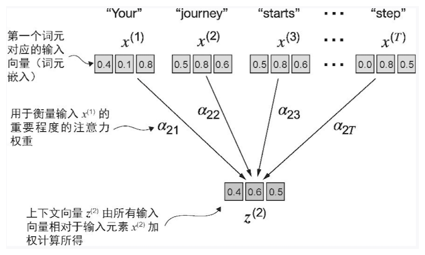

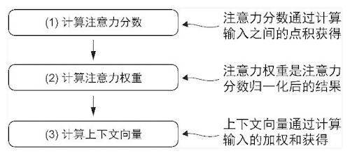


在自注意力机制中，“自”指的是该机制通过关联单个输入序列中的不同位置来计算注意力权重的能力。

点积不仅被视为一种将两个向量转化为标量值的数学工具，而且也是度量相似度的一种方式，因为它可以量化两个向量之间的对齐程度：点积越大，向量之间的对齐程度或相似度就越高。

### 计算注意力分数

注意力分数：查询词元与其他词元的点积

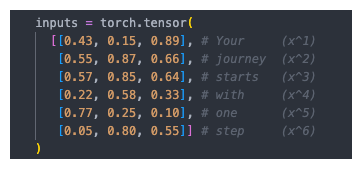

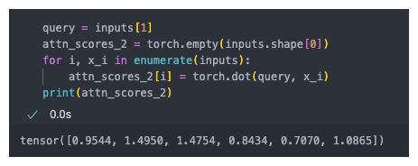


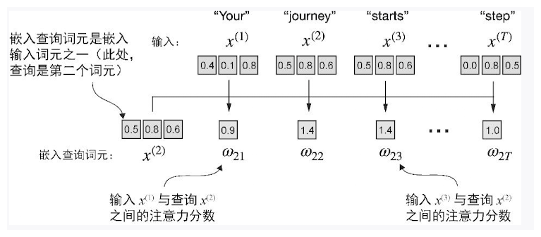


### 计算注意力权重

注意力权重：将注意力分数使用softmax函数进行归一化

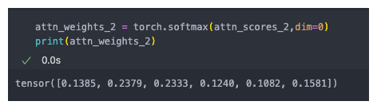


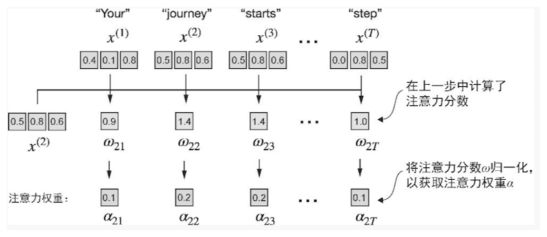


### 计算上下文向量

上下文向量是权重矩阵与输入词元的点积，所以要先计算出所有的注意力分数以及上下文权重

1. 计算所有的词元的注意力分数
    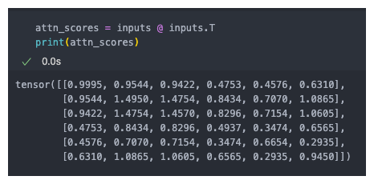
2. 计算所有词元的注意力权重
    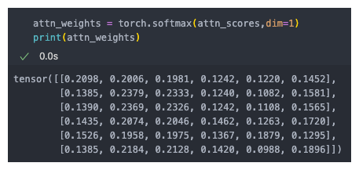


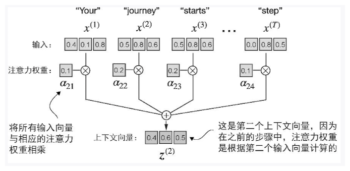


最后计算上下文向量即可：

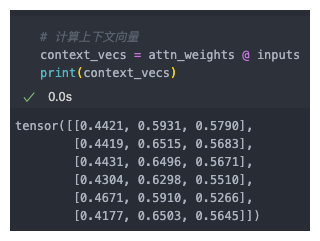

